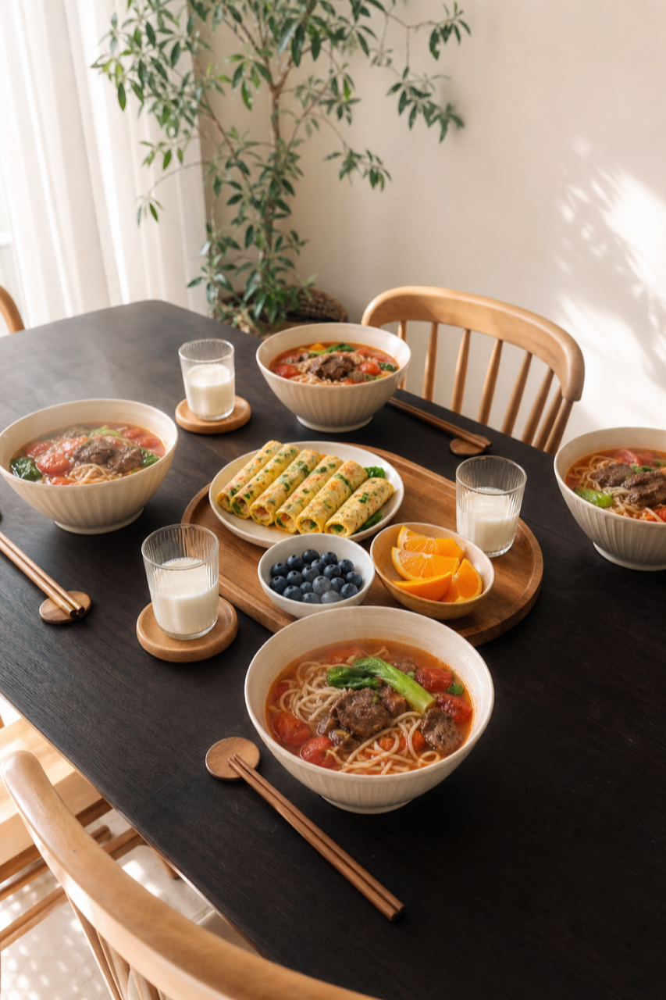
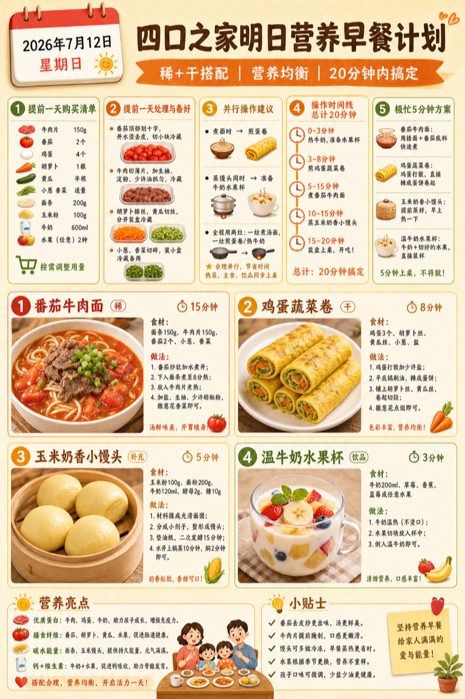
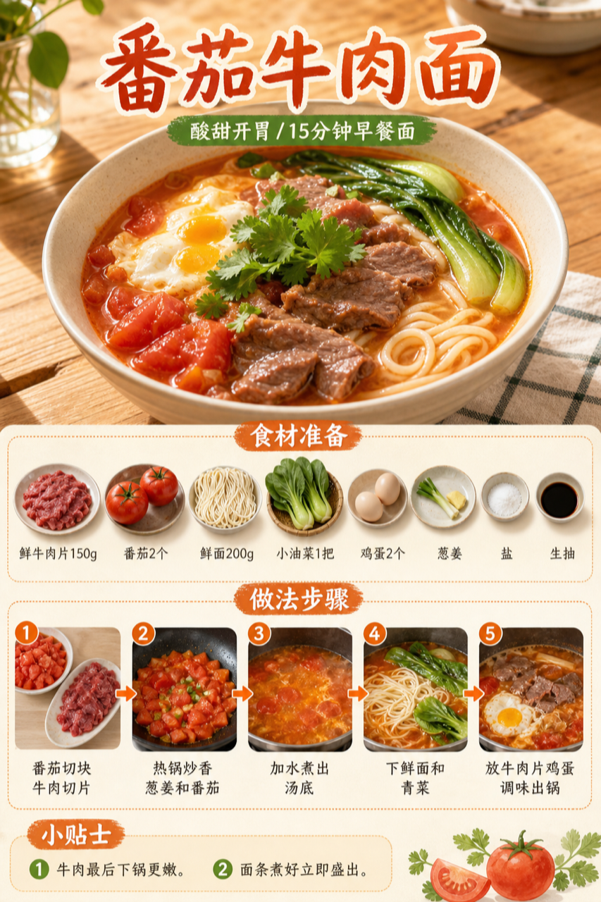

# 2026-07-12 小红书早餐交付

**发布状态：** `ready_for_review`，未发布，仅供人工确认。

## 小红书标题

跟着 Tiny.C 吃30天早餐｜第13天｜四口之家20分钟牛肉面早餐

## 小红书正文

第13天做牛肉面类：番茄牛肉面配鸡蛋蔬菜卷，再加玉米小馒头、温牛奶和水果。番茄开胃，牛肉鸡蛋补优质蛋白，孩子长高有料，老人吃着软和，上班族也能顶饱。今晚切好番茄胡萝卜、分装牛肉，早上20分钟上桌。关注我，明早继续抄作业。

## 流量标签

#早餐 #儿童早餐 #家庭早餐 #长高早餐 #四口之家早餐 #一锅出 #不开火备餐 #干净饮食 #中式轻食 #家常美食

热词来源：[weekly-hot-tags.json](weekly-hot-tags.json)

## 互动问题

明天我做 4 个版本：
A. 小学生长高版
B. 老人好消化版
C. 上班族快手版
D. 评论区留下你专属版

你家更需要哪个？评论 A/B/C/D，我按票数发；选 D 的直接留下年龄、家庭人数、忌口和早上可用时间。
关注我，明早直接抄作业。

## 置顶评论

想要「7天不重样早餐表」的，评论“7天”。选 D 的留下年龄、家庭人数、忌口和早上可用时间，我会挑典型家庭做专属版，后面每天更新。

## 明天预告

明天预告：不喝牛奶也高钙版四口之家20分钟中式早餐。

## 配图

1. [真实家庭餐桌图](01-real-family-table.png)

   

2. [最终版信息图](02-final-infographic.png)

   

3. [番茄牛肉面过程图](03-tomato-beef-noodle-process.png)

   

4. [鸡蛋蔬菜卷过程图](04-egg-vegetable-roll-process.png)

   

## 归档

- [内容包 JSON](content-package.json)
- [热词台账](weekly-hot-tags.json)
