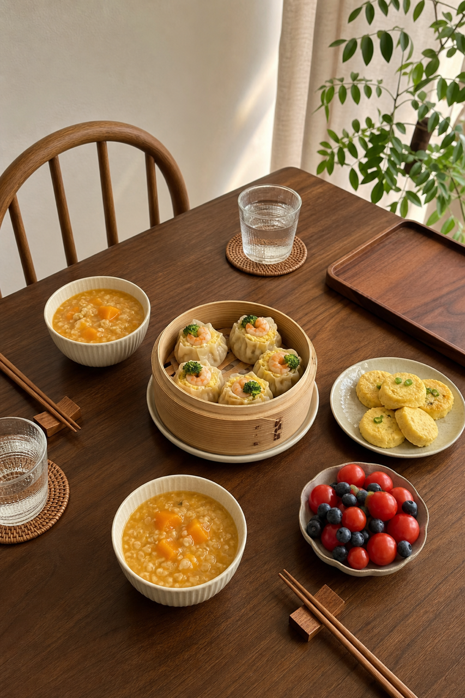
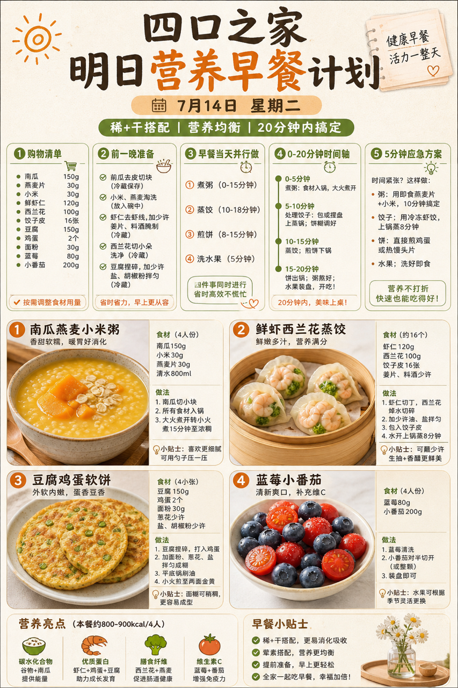
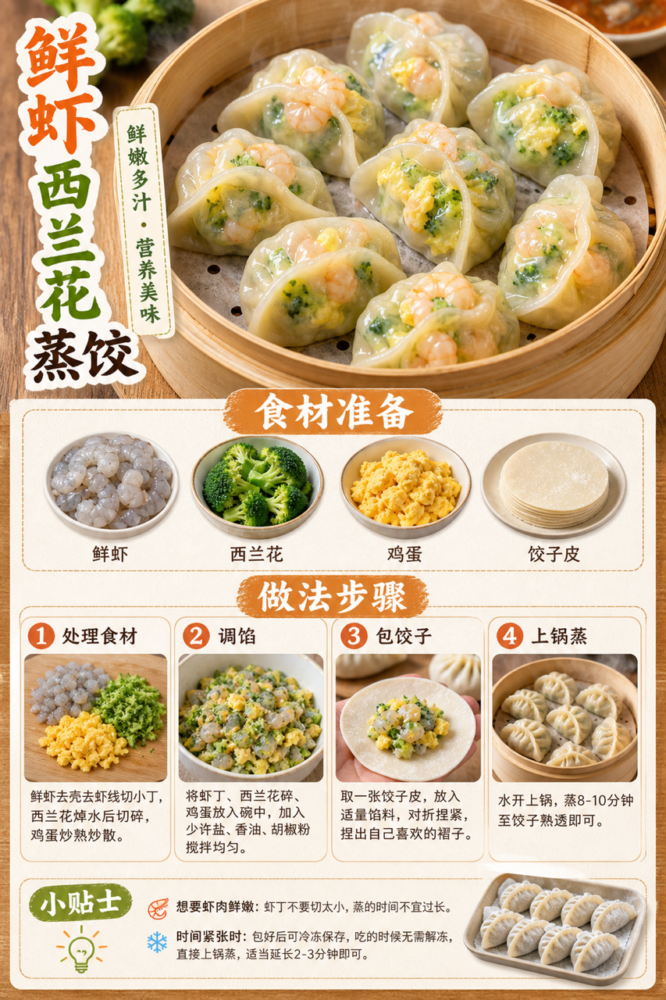

# 2026-07-14 小红书早餐交付

## 小红书标题

跟着 Tiny.C 吃30天早餐｜第15天｜四口之家20分钟煎饼早餐

## 小红书正文

第15天用南瓜燕麦小米粥配豆腐鸡蛋软饼，搭鲜虾西兰花蒸饺和蓝莓小番茄。今晚把南瓜切块、鲜虾去线，早上煮粥的同时蒸饺、煎软饼，20分钟上桌。蛋白质、钙和蔬果都顾到，孩子吃得香，老人也能吃软和。忙到来不及就用冷冻蒸饺加即食燕麦粥顶上。关注我，明早继续抄作业。

## 流量标签

#早餐 #儿童早餐 #家庭早餐 #长高早餐 #四口之家早餐 #美食 #美食教程 #夏日消暑风味集 #小红书爆款美食 #代餐

## 互动问题

明天我做4个版本：A. 小学生长高版 B. 老人好消化版 C. 上班族快手版 D. 评论区留下你专属版。你家更需要哪个？评论 A/B/C/D，我按票数发；选 D 的直接留下年龄、家庭人数、忌口和早上可用时间。

## 置顶评论

想要「7天不重样早餐表」的，评论“7天”。选 D 的留下年龄、家庭人数、忌口和早上可用时间，我会挑典型家庭做专属版，后面每天更新。

## 明天预告

明天预告：牛肉补铁、包子顶饱的四口之家20分钟早餐。

## 发布状态

未发布，仅生成待人工确认内容。建议在次日早间发布；不自动发布到小红书。

## 热词台账

[weekly-hot-tags.json](weekly-hot-tags.json)

## 配图

