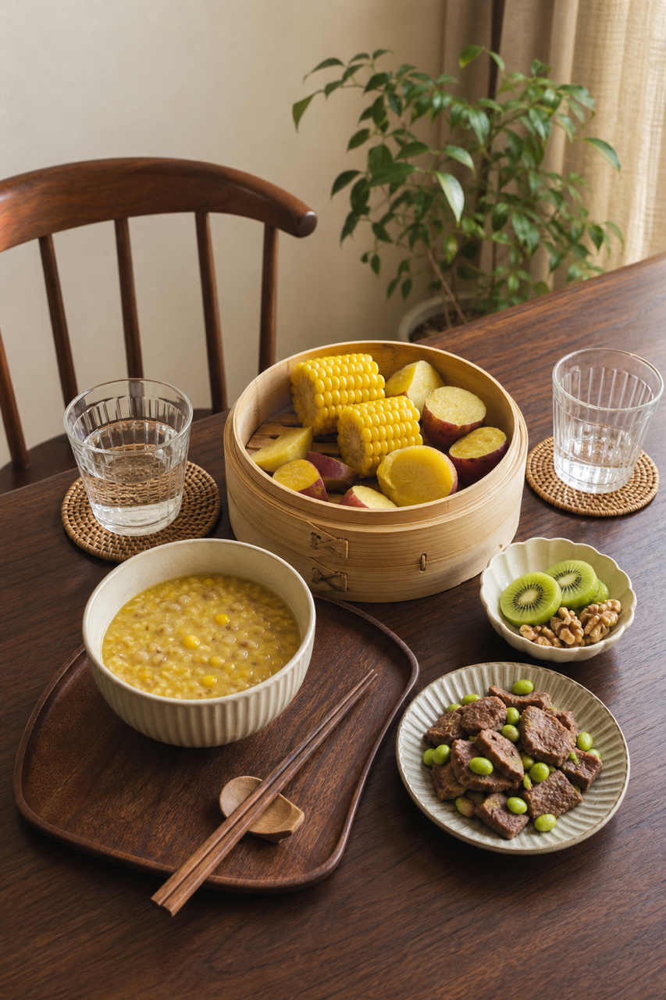
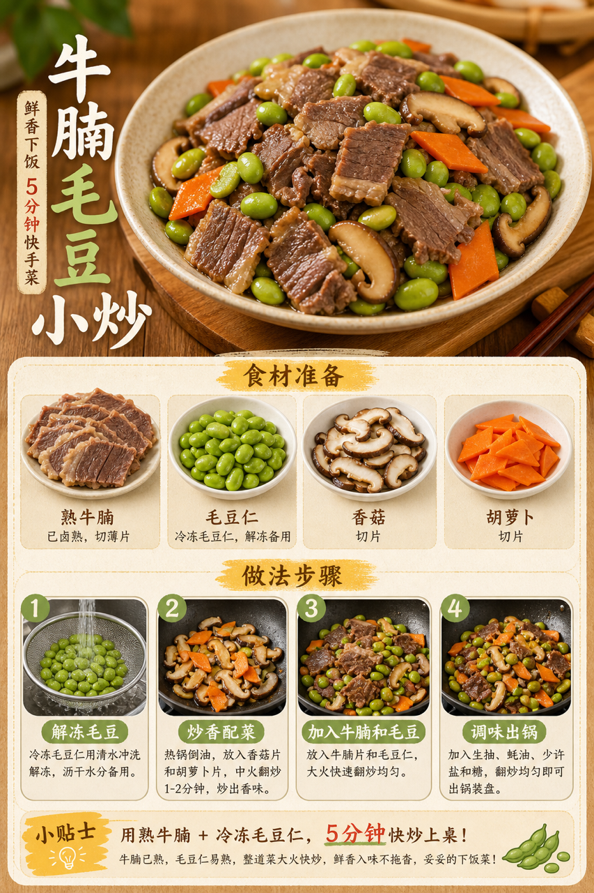

# 2026-07-16 小红书早餐交付

## 小红书标题

跟着 Tiny.C 吃30天早餐｜第17天｜四口之家20分钟玉米红薯早餐

## 小红书正文

第17天换玉米红薯类：玉米红薯燕麦糊配蒸红薯玉米，再加牛腩毛豆小炒和猕猴桃核桃。牛腩提前卤好、毛豆冷冻分装，早上蒸锅蒸主食，料理机打糊，平底锅5分钟炒牛腩，20分钟就能吃。玉米红薯顶饱，牛腩补铁，毛豆补蛋白，孩子、哺乳期和老人都能吃得舒服。极忙时直接蒸熟红薯配常温奶。关注我，明早继续抄作业。

## 流量标签

#早餐 #儿童早餐 #家庭早餐 #长高早餐 #四口之家早餐 #美食 #美食教程 #夏日消暑风味集 #小红书爆款美食 #代餐

## 互动问题

明天我做4个版本：A. 小学生长高版 B. 老人好消化版 C. 上班族快手版 D. 评论区留下你专属版。你家更需要哪个？评论 A/B/C/D，我按票数发；选 D 的直接留下年龄、家庭人数、忌口和早上可用时间。

## 置顶评论

想要「7天不重样早餐表」的，评论“7天”。选 D 的留下年龄、家庭人数、忌口和早上可用时间，我会挑典型家庭做专属版，后面每天更新。

## 明天预告

明天预告：鱼肉豆腐汤面，夏天也能吃得清爽的高蛋白版。

## 发布状态

未发布，仅生成待人工确认内容。建议在次日早间发布；不自动发布到小红书。

## 热词台账

[weekly-hot-tags.json](weekly-hot-tags.json)

## 配图

