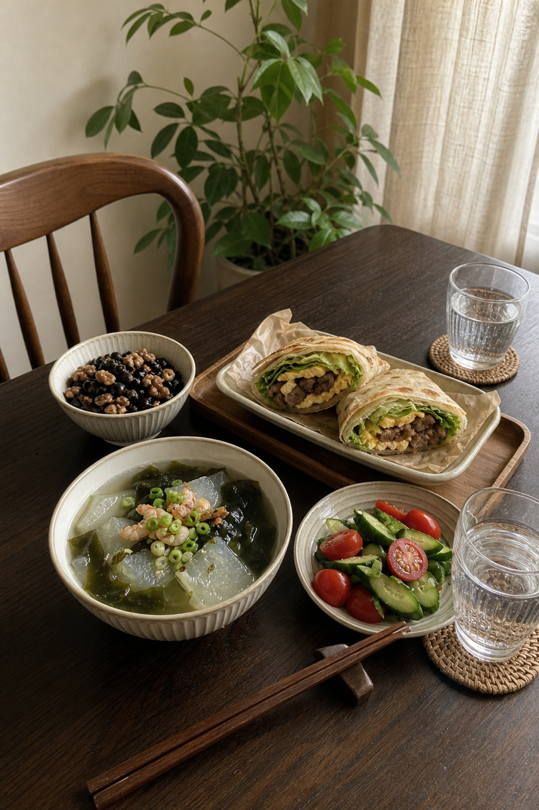
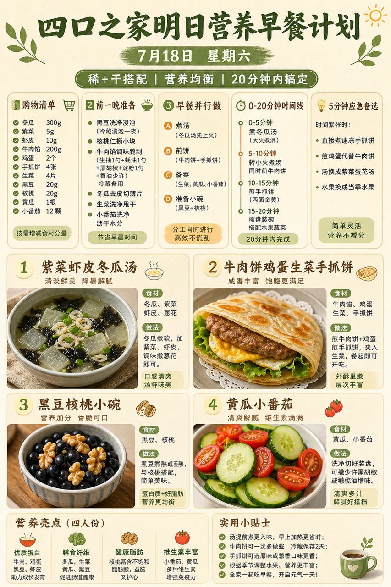
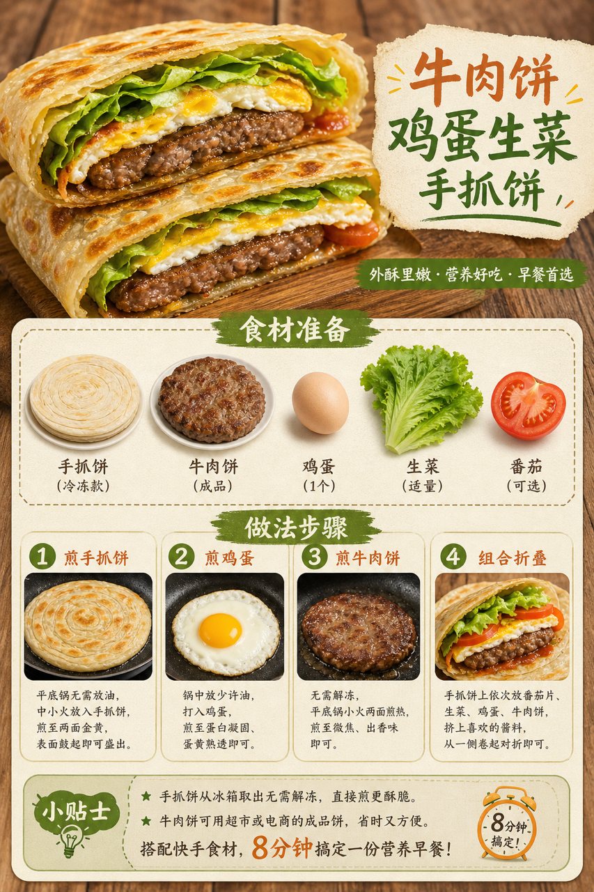

# 2026-07-18 小红书早餐交付

## 小红书标题

跟着 Tiny.C 吃30天早餐｜第18天｜四口之家20分钟手抓饼早餐

## 小红书正文

第18天换手抓饼类：紫菜虾皮冬瓜汤配牛肉饼鸡蛋生菜手抓饼，再加黑豆核桃小碗和黄瓜小番茄。今晚泡黑豆、把牛肉饼调味冷藏，早上先煮汤，平底锅同时煎手抓饼、鸡蛋和牛肉饼，20分钟热乎上桌。牛肉和鸡蛋补优质蛋白，黑豆核桃补纤维和好脂肪，孩子吃得香，老人也能咬得动。极忙时冷冻手抓饼配鸡蛋就够。关注我，明早继续抄作业。

## 流量标签

#早餐 #儿童早餐 #家庭早餐 #长高早餐 #四口之家早餐 #给阿嬷的情书 #草台就是最好的班子 #前额叶 #旅游兴趣班 #小字成语

## 互动问题

明天我做4个版本：A. 小学生长高版 B. 老人好消化版 C. 上班族快手版 D. 评论区留下你专属版。你家更需要哪个？评论 A/B/C/D，我按票数发；选 D 的直接留下年龄、家庭人数、忌口和早上可用时间。

## 置顶评论

想要「7天不重样早餐表」的，评论“7天”。选 D 的留下年龄、家庭人数、忌口和早上可用时间，我会挑典型家庭做专属版，后面每天更新。

## 明天预告

明天预告：虾仁豆腐杂粮饭团，周末一手拿着吃的高蛋白版。

## 发布状态

未发布，仅生成待人工确认内容。建议在次日早间发布；不自动发布到小红书。

## 热词台账

[weekly-hot-tags.json](weekly-hot-tags.json)

## 配图

