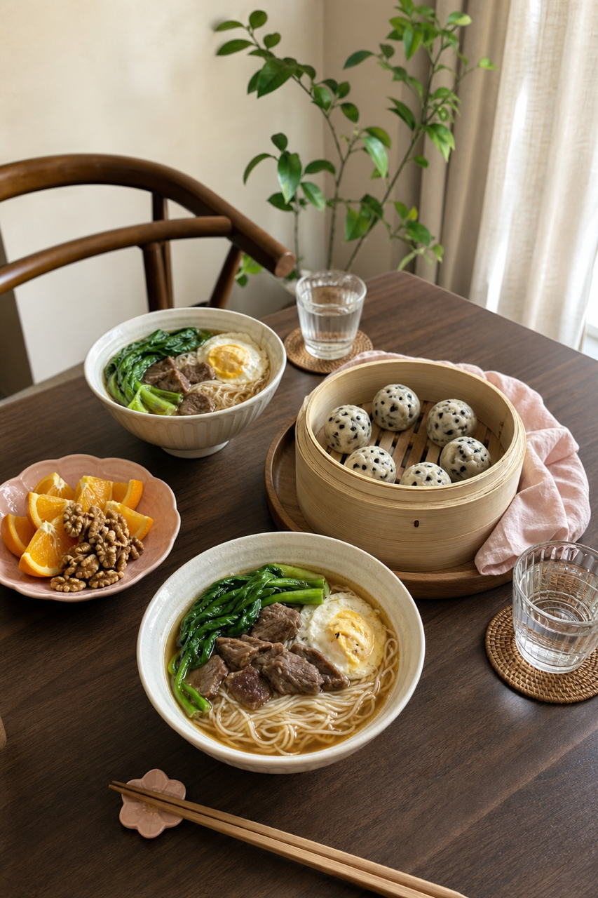
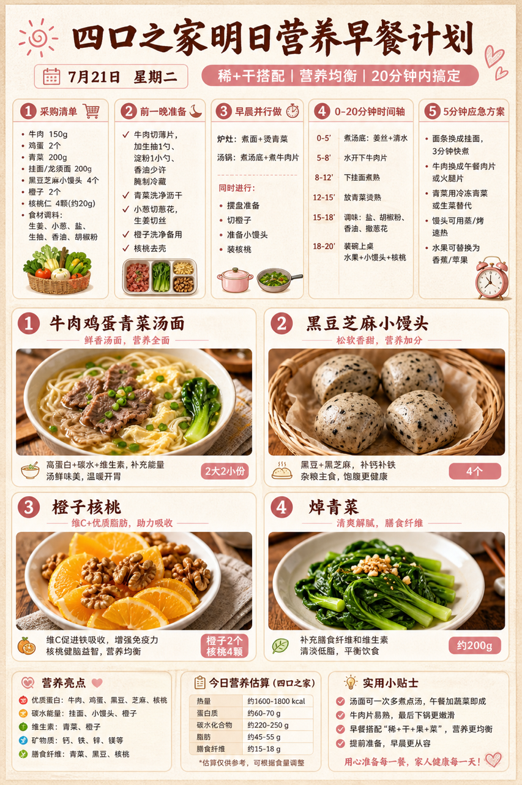
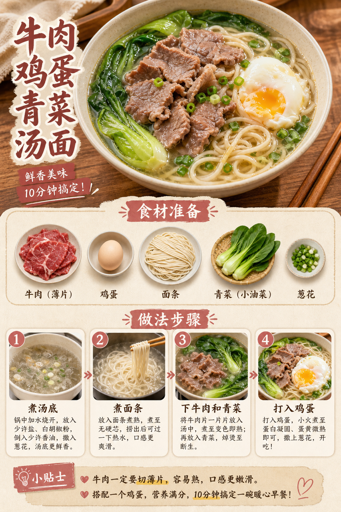

# 2026-07-21 小红书早餐交付

## 小红书标题

跟着 Tiny.C 吃30天早餐｜第21天｜四口之家20分钟汤面早餐

## 小红书正文

第21天换汤面类：牛肉鸡蛋青菜汤面配黑豆芝麻小馒头，再加橙子核桃。今晚把牛肉切薄片、青菜洗好，小馒头冷冻备着；早上煮汤面、烫青菜同步做，20分钟热乎上桌。牛肉和鸡蛋补优质蛋白，黑豆补纤维和矿物质，孩子吃得香，老人也能吃软和。极忙时用挂面、鸡蛋和现成小馒头顶上。关注我，明早继续抄作业。

## 流量标签

#早餐 #儿童早餐 #家庭早餐 #长高早餐 #四口之家早餐 #复合风味 #古法美食 #身心脑三位一体育儿 #儿童成长 #全员友好

## 互动问题

明天我做4个版本：A. 小学生长高版 B. 老人好消化版 C. 上班族快手版 D. 评论区留下你专属版。你家更需要哪个？评论 A/B/C/D，我按票数发；选 D 的直接留下年龄、家庭人数、忌口和早上可用时间。

## 置顶评论

想要「7天不重样早餐表」的，评论“7天”。选 D 的留下年龄、家庭人数、忌口和早上可用时间，我会挑典型家庭做专属版，后面每天更新。

## 明天预告

明天预告：虾仁杂粮饭团，周末一手拿着吃的高蛋白版。

## 发布状态

未发布，仅生成待人工确认内容。建议在次日早间发布；不自动发布到小红书。

## 热词台账

[weekly-hot-tags.json](weekly-hot-tags.json)

## 配图

