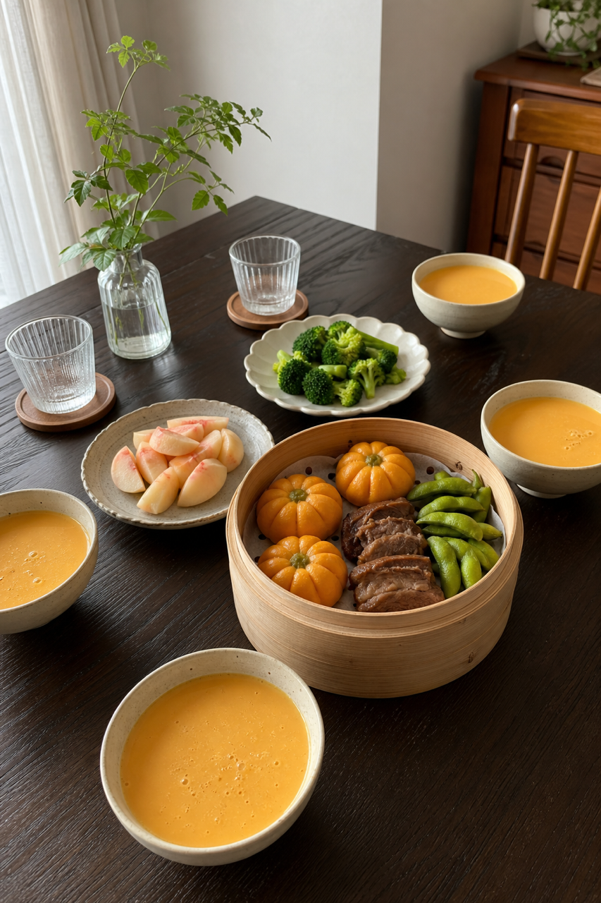
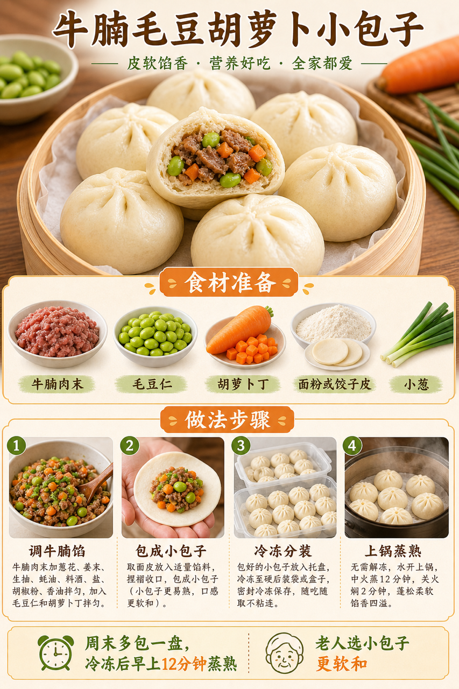

# 2026-07-28 小红书早餐交付

## 小红书标题

跟着 Tiny.C 吃30天早餐｜第28天｜四口之家20分钟包子早餐

## 小红书正文

第28天做奶油橙包子早餐：牛腩毛豆胡萝卜小包子配南瓜黄豆豆浆，再加西兰花和桃子。今晚牛腩馅包好冷冻、黄豆泡好；早上蒸包子、料理机打豆浆同步焯菜，20分钟出餐。牛腩补铁，毛豆和黄豆添蛋白，软包子和温豆浆老人也好入口。极忙时用冷冻包子加无糖豆浆，5分钟热乎上桌。关注我，明早继续抄作业。

## 流量标签

#早餐 #儿童早餐 #家庭早餐 #长高早餐 #四口之家早餐 #周小闹 #爆姐 #绵羊料理 #小镇上的猪精 #千金饱了

## 互动问题

明天我做4个版本：A. 小学生长高版 B. 老人好消化版 C. 上班族快手版 D. 评论区留下你专属版。你家更需要哪个？评论 A/B/C/D，我按票数发；选 D 的直接留下年龄、家庭人数、忌口和早上可用时间。

## 置顶评论

想要「7天不重样早餐表」的，评论“7天”。选 D 的留下年龄、家庭人数、忌口和早上可用时间，我会挑典型家庭做专属版，后面每天更新。

## 明天预告

明天预告：黑芝麻鸡蛋杂粮软饼，不喝牛奶也高钙版。

## 发布状态

未发布，仅生成待人工确认内容。建议于 2026-07-28 早间发布；不自动发布到小红书。

## 热词台账

[weekly-hot-tags.json](weekly-hot-tags.json)

## 配图

