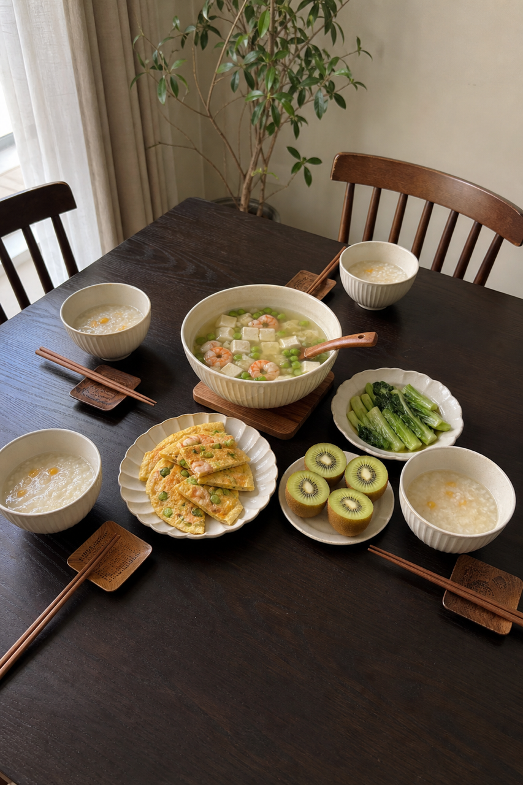
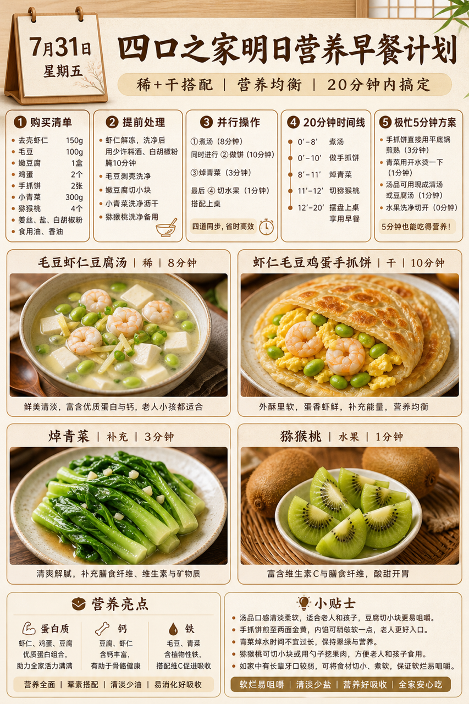
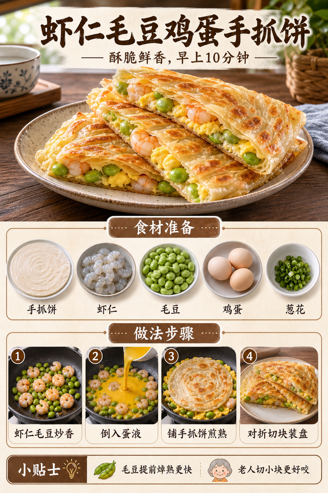

# 2026-07-31 小红书早餐交付

## 小红书标题

跟着 Tiny.C 吃30天早餐｜第31天｜四口之家20分钟手抓饼早餐

## 小红书正文

第31天做日式木色手抓饼：毛豆虾仁豆腐汤配虾仁毛豆鸡蛋手抓饼，再加焯青菜和猕猴桃。今晚虾仁解冻、毛豆焯熟，手抓饼冷藏；早上煮汤、平底锅煎饼同步焯菜，20分钟热乎上桌。虾仁补优质蛋白，毛豆和豆腐添钙和植物蛋白，手抓饼顶饱；老人把饼和豆腐都切小块更好咬。极忙时用速冻手抓饼配即食豆腐汤，5分钟也能吃。关注我，明早继续抄作业。

## 流量标签

#早餐 #儿童早餐 #家庭早餐 #长高早餐 #四口之家早餐 #就你吃不饱 #佳减乘除 #Nico爱肉包 #悦鲜活鲜奶 #林述巍林大厨

## 互动问题

明天我做4个版本：A. 小学生长高版 B. 老人好消化版 C. 上班族快手版 D. 评论区留下你专属版。你家更需要哪个？评论 A/B/C/D，我按票数发；选 D 的直接留下年龄、家庭人数、忌口和早上可用时间。

## 置顶评论

想要「7天不重样早餐表」的，评论“7天”。选 D 的留下年龄、家庭人数、忌口和早上可用时间，我会挑典型家庭做专属版，后面每天更新。

## 明天预告

明天预告：南瓜小米牛肉饭团，周末全家出门顶饱版。

## 发布状态

未发布，仅生成待人工确认内容。建议于 2026-07-31 早间发布；不自动发布到小红书。

## 热词台账

[weekly-hot-tags.json](weekly-hot-tags.json)

## 配图

