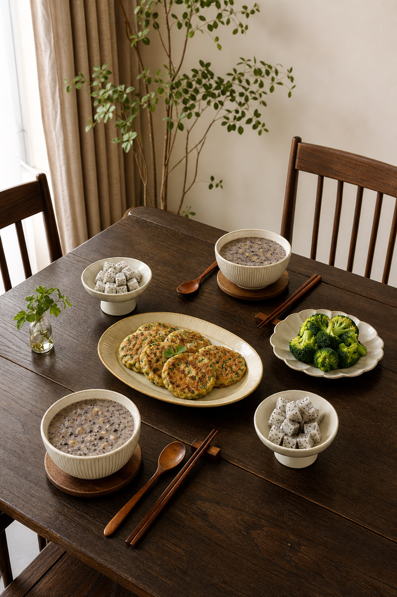
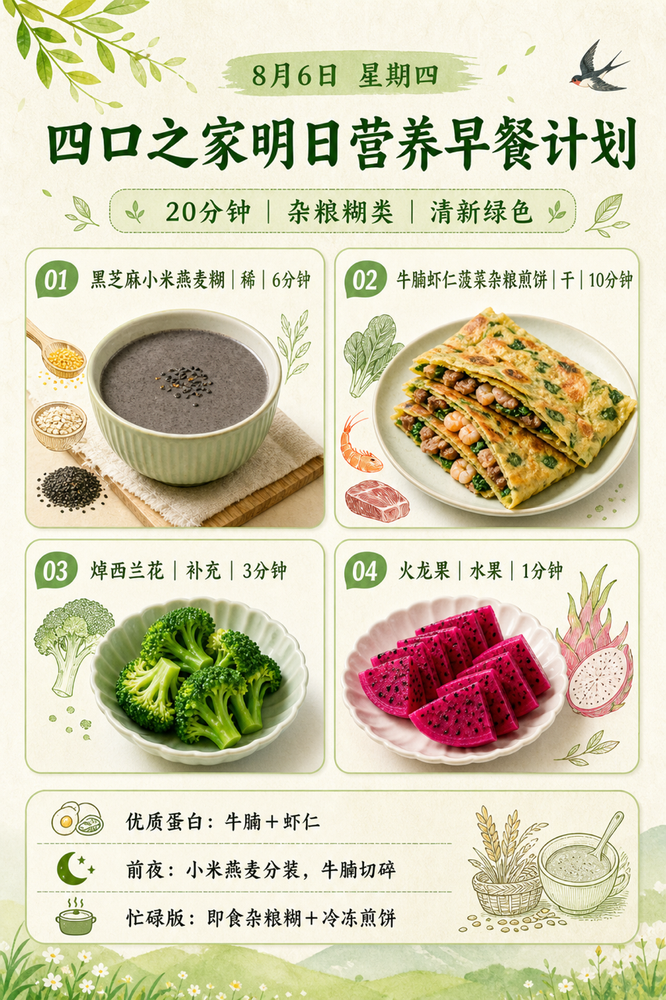
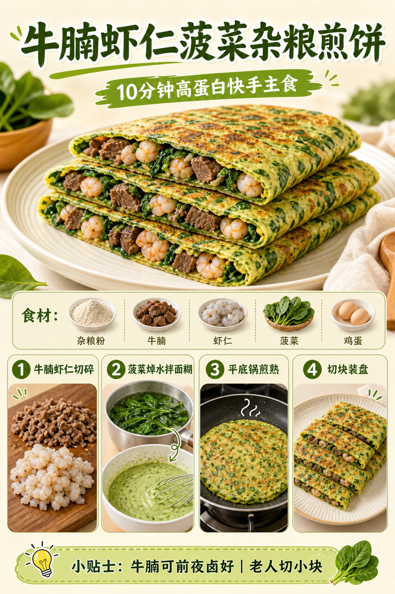

# 2026-08-06 四口之家早餐内容包

## 小红书标题

跟着 Tiny.C 吃30天早餐｜第36天｜四口之家20分钟杂粮糊早餐

## 小红书正文

第36天做清新绿色杂粮糊早餐：黑芝麻小米燕麦糊配牛腩虾仁菠菜杂粮煎饼，再加焯西兰花和火龙果。今晚小米燕麦分装、牛腩切碎，虾仁解冻；早上料理机煮杂粮糊、平底锅煎饼同步焯菜，20分钟热乎上桌。牛腩和虾仁补优质蛋白和铁，黑芝麻添钙，杂粮更顶饱；老人把煎饼切小块、杂粮糊打细更好入口。极忙时用即食杂粮糊配冷冻煎饼，5分钟也能吃。关注我，明早继续抄作业。

## 流量标签

#早餐 #儿童早餐 #家庭早餐 #长高早餐 #四口之家早餐 #佳减乘除 #小沈美眉 #潘姥姥 #吃货老外铁蛋儿 #林述巍林大厨

## 互动问题

明天我做4个版本：A. 小学生长高版 B. 老人好消化版 C. 上班族快手版 D. 评论区留下你专属版。你家更需要哪个？评论 A/B/C/D，我按票数发；选 D 的直接留下年龄、家庭人数、忌口和早上可用时间。

## 置顶评论

想要「7天不重样早餐表」的，评论“7天”。选 D 的留下年龄、家庭人数、忌口和早上可用时间，我会挑典型家庭做专属版，后面每天更新。

## 明天预告

明天预告：鲜虾紫菜小馄饨，开学前早起不慌版。

## 发布状态

`ready_for_review`（仅生成待人工审核内容，不发布到小红书）

## 热词台账

[weekly-hot-tags.json](weekly-hot-tags.json)

## 配图

1. 
2. 
3. 
