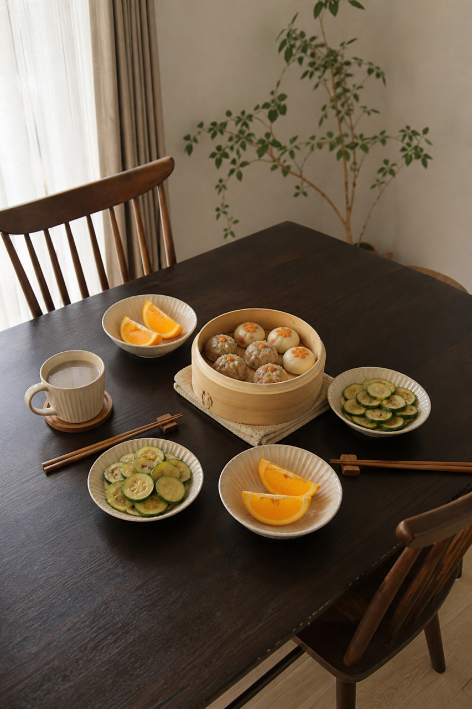
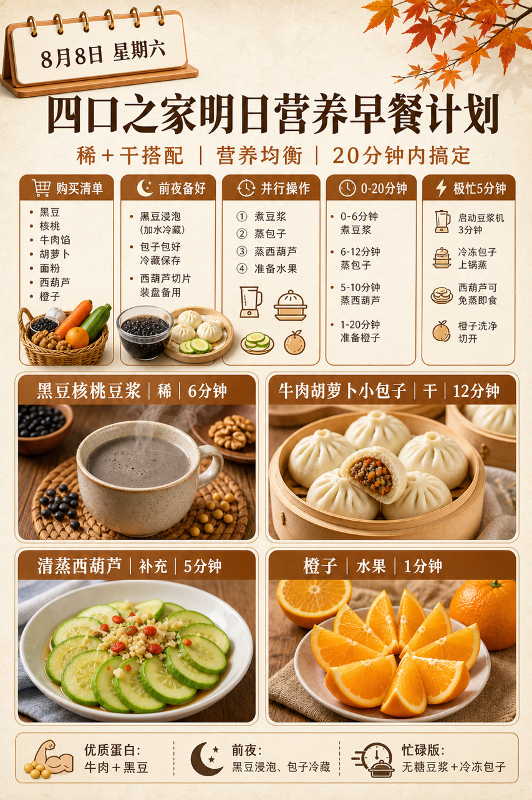
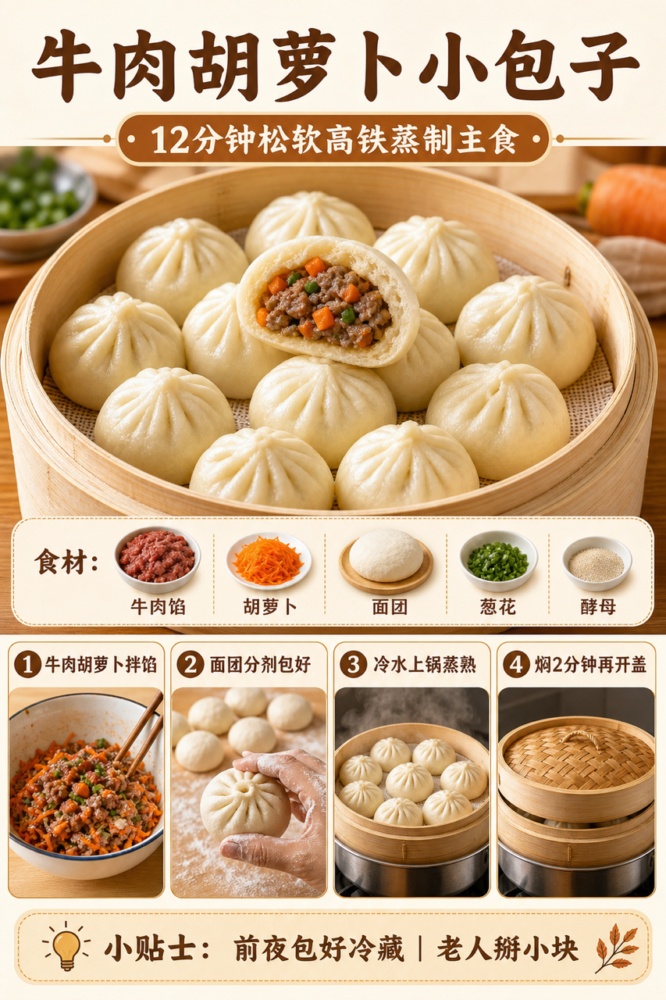

# 2026-08-08 四口之家早餐内容包

## 小红书标题

跟着 Tiny.C 吃30天早餐｜第38天｜四口之家20分钟蒸制早餐

## 小红书正文

第38天做暖棕蒸制早餐：黑豆核桃豆浆配牛肉胡萝卜小包子，再加清蒸西葫芦和橙子。今晚黑豆泡好、牛肉馅调味，小包子包好冷藏；早上豆浆机开煮，蒸锅热包子同步蒸菜，20分钟上桌。牛肉补铁，黑豆与核桃添植物蛋白和好脂肪，孩子和哺乳期妈妈更顶饱；老人把包子掰小块、豆浆打细。极忙时无糖豆浆配冷冻包子，5分钟也温热。关注我，明早继续抄作业。

## 流量标签

#早餐 #儿童早餐 #家庭早餐 #长高早餐 #四口之家早餐 #奎妮在中国 #特猫头zZ #神奇米米 #吃货老外铁蛋儿 #潘姥姥

## 互动问题

明天我做4个版本：A. 小学生长高版 B. 老人好消化版 C. 上班族快手版 D. 评论区留下你专属版。你家更需要哪个？评论 A/B/C/D，我按票数发；选 D 的直接留下年龄、家庭人数、忌口和早上可用时间。

## 置顶评论

想要「7天不重样早餐表」的，评论“7天”。选 D 的留下年龄、家庭人数、忌口和早上可用时间，我会挑典型家庭做专属版，后面每天更新。

## 明天预告

明天预告：鲜虾玉米发面饼，周日全家补蛋白版。

## 发布状态

`ready_for_review`（仅生成待人工审核内容，不发布到小红书）

## 热词台账

[weekly-hot-tags.json](weekly-hot-tags.json)

## 配图

1. 
2. 
3. 
