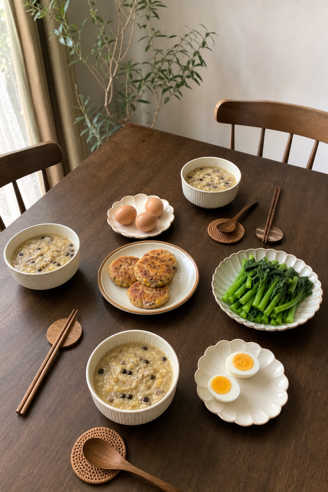

# 2026-08-11 四口之家早餐内容包

## 小红书标题

跟着 Tiny.C 吃30天早餐｜第40天｜四口之家20分钟玉米红薯早餐

## 小红书正文

第40天做莫兰迪色玉米红薯早餐：黑豆百合小米糊配玉米红薯牛肉饼，再加水煮蛋和焯菜心。今晚黑豆泡好、红薯蒸熟压泥，牛肉馅分装；早上料理机煮米糊，平底锅煎牛肉饼同步煮蛋焯菜，20分钟上桌。牛肉和鸡蛋补蛋白与铁，黑豆添植物蛋白，玉米红薯管饱；老人把饼切小、米糊打细。极忙时用即食米糊配冷冻牛肉饼，5分钟开饭。关注我，明早继续抄作业。

## 流量标签

#早餐 #儿童早餐 #家庭早餐 #长高早餐 #四口之家早餐 #潘姥姥 #奎妮在中国 #村民揍饭 #佳减乘除 #吃货老外铁蛋儿

## 互动问题

明天我做4个版本：A. 小学生长高版 B. 老人好消化版 C. 上班族快手版 D. 评论区留下你专属版。你家更需要哪个？评论 A/B/C/D，我按票数发；选 D 的直接留下年龄、家庭人数、忌口和早上可用时间。

## 置顶评论

想要「7天不重样早餐表」的，评论“7天”。选 D 的留下年龄、家庭人数、忌口和早上可用时间，我会挑典型家庭做专属版，后面每天更新。

## 明天预告

明天预告：虾仁菌菇汤面，开学早起快手版。

## 发布状态

`ready_for_review`（仅生成待人工审核内容，不发布到小红书）

## 热词台账

[weekly-hot-tags.json](weekly-hot-tags.json)

## 配图

1. 
2. 
3. 
