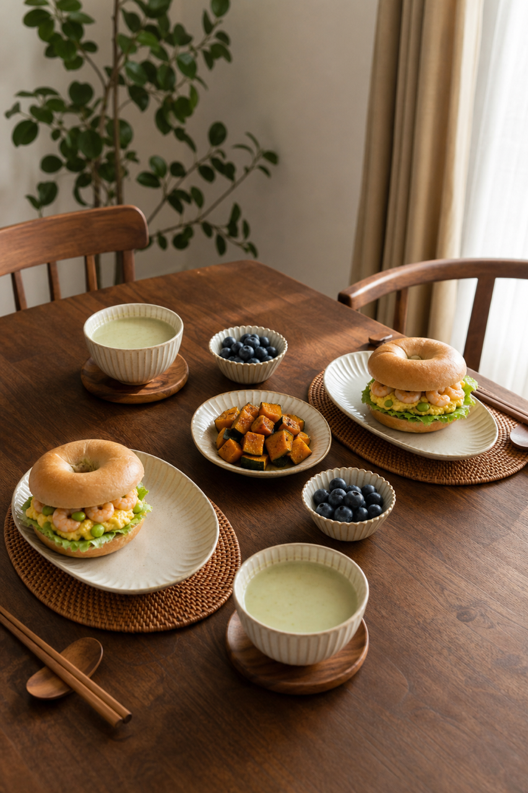

# 2026-08-12 四口之家早餐内容包

## 小红书标题

跟着 Tiny.C 吃30天早餐｜第41天｜四口之家20分钟贝果早餐

## 小红书正文

第41天做奶油橙贝果早餐：毛豆燕麦豆浆配虾仁毛豆鸡蛋贝果，再加烤南瓜和蓝莓。今晚毛豆焯熟、虾仁解冻、南瓜切块；早上豆浆机开煮，平底锅炒蛋虾仁、贝果烤热同步烤南瓜，20分钟上桌。虾仁和鸡蛋补优质蛋白，毛豆添植物蛋白，贝果顶饱；老人去掉贝果硬边、豆浆打细更好入口。极忙时无糖豆浆配即食贝果，5分钟也能吃。关注我，明早继续抄作业。

## 流量标签

#早餐 #儿童早餐 #家庭早餐 #长高早餐 #四口之家早餐 #奎妮在中国 #小伶很忙 #佳减乘除 #小饭桃桃 #特猫头zZ

## 互动问题

明天我做4个版本：A. 小学生长高版 B. 老人好消化版 C. 上班族快手版 D. 评论区留下你专属版。你家更需要哪个？评论 A/B/C/D，我按票数发；选 D 的直接留下年龄、家庭人数、忌口和早上可用时间。

## 置顶评论

想要「7天不重样早餐表」的，评论“7天”。选 D 的留下年龄、家庭人数、忌口和早上可用时间，我会挑典型家庭做专属版，后面每天更新。

## 明天预告

明天预告：三文鱼杂粮饭团，孩子开学补脑版。

## 发布状态

`ready_for_review`（仅生成待人工审核内容，不发布到小红书）

## 热词台账

[weekly-hot-tags.json](weekly-hot-tags.json)

## 配图

1. 
2. 
3. 
