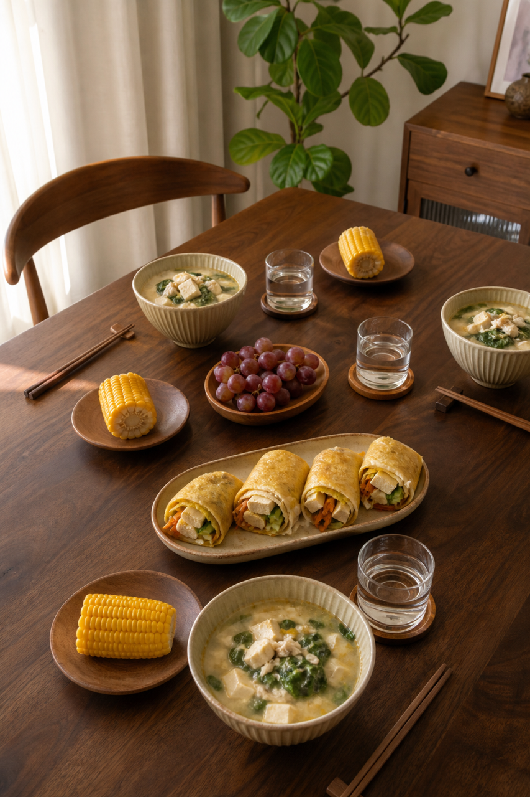
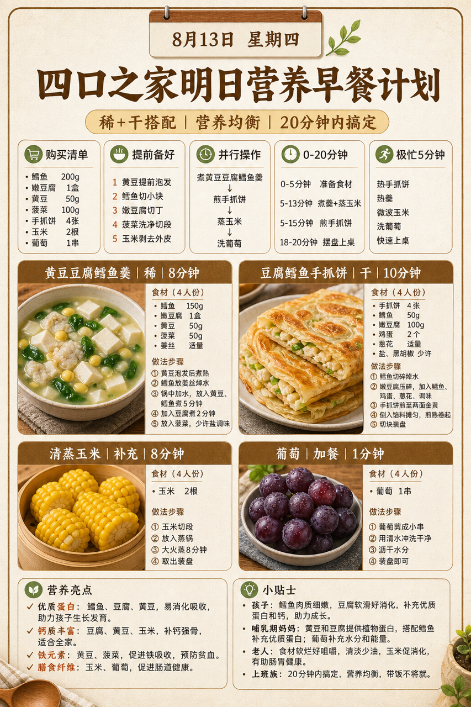
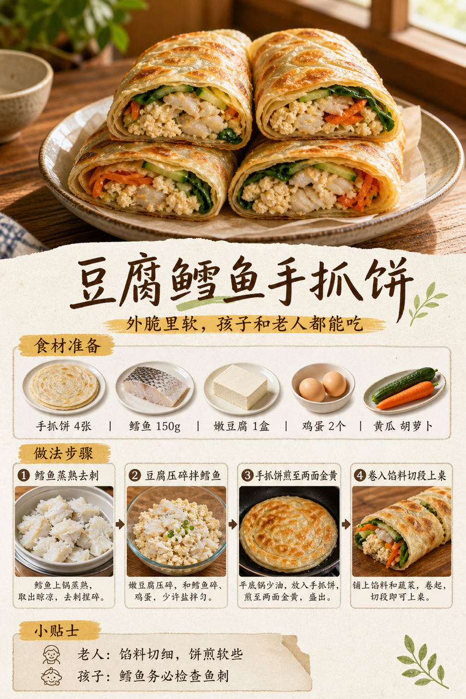

# 2026-08-13 四口之家早餐内容包

## 小红书标题

跟着 Tiny.C 吃30天早餐｜第42天｜四口之家20分钟手抓饼早餐

## 小红书正文

第42天做日式木色手抓饼早餐：黄豆豆腐鳕鱼羹配豆腐鳕鱼手抓饼，再加清蒸玉米和葡萄。晚上黄豆泡发、鳕鱼去刺分装、蔬菜洗净；早上羹煮8分钟，手抓饼卷馅同步蒸玉米，20分钟上桌。鳕鱼和豆腐补优质蛋白，黄豆添钙和铁；女儿和哺乳期都适合，老人馅料切细、饼煎软些。极忙时热手抓饼夹豆腐，配无糖豆浆，5分钟搞定。关注我，明早继续抄作业。

## 流量标签

#早餐 #儿童早餐 #家庭早餐 #长高早餐 #四口之家早餐 #李维嘉 #鲨鲨牙大王 #吃李子 #潘姥姥 #颖妹🌸

## 互动问题

明天我做4个版本：A. 小学生长高版 B. 老人好消化版 C. 上班族快手版 D. 评论区留下你专属版。你家更需要哪个？评论 A/B/C/D，我按票数发；选 D 的直接留下年龄、家庭人数、忌口和早上可用时间。

## 置顶评论

想要「7天不重样早餐表」的，评论“7天”。选 D 的留下年龄、家庭人数、忌口和早上可用时间，我会挑典型家庭做专属版，后面每天更新。

## 明天预告

明天预告：牛肉蔬菜杂粮饭团，开学早起顶饱版。

## 发布状态

`ready_for_review`；未发布，仅供人工确认。

## 热词台账

[查看本周热词台账](weekly-hot-tags.json)

## 配图预览

1. 真实家庭餐桌早餐成品图
   
2. 日式木色高信息密度早餐总览信息图
   
3. 豆腐鳕鱼手抓饼制作过程图
   

## 发布描述

建议人工审核后于早间早餐时段发布；配图按上述 1-3 顺序上传。标题、正文、标签、互动问题、置顶评论和明天预告均已同步至本页；本内容包不执行自动发布。
