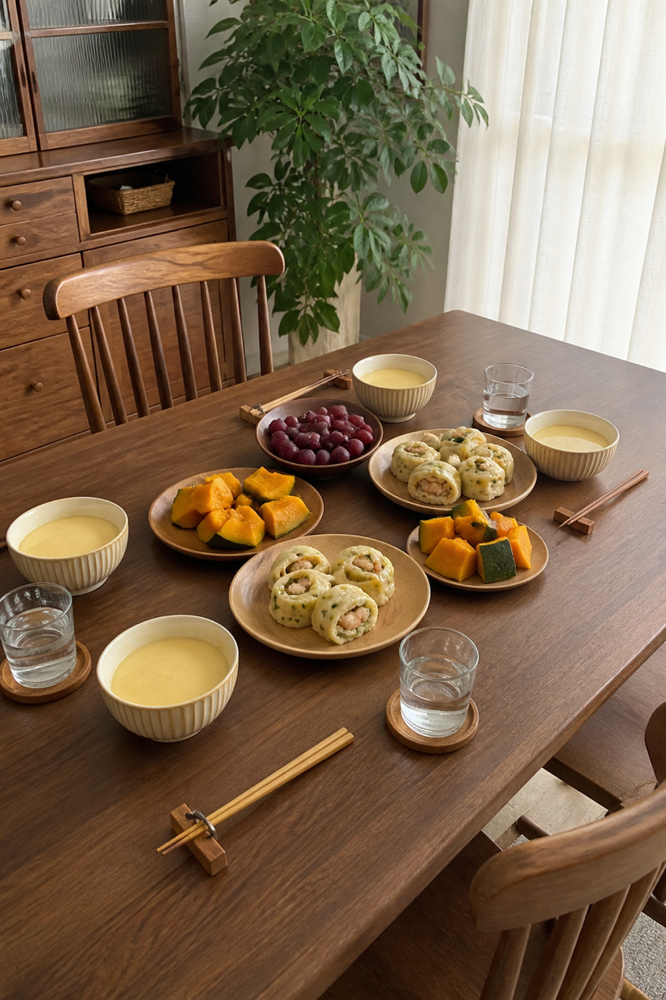
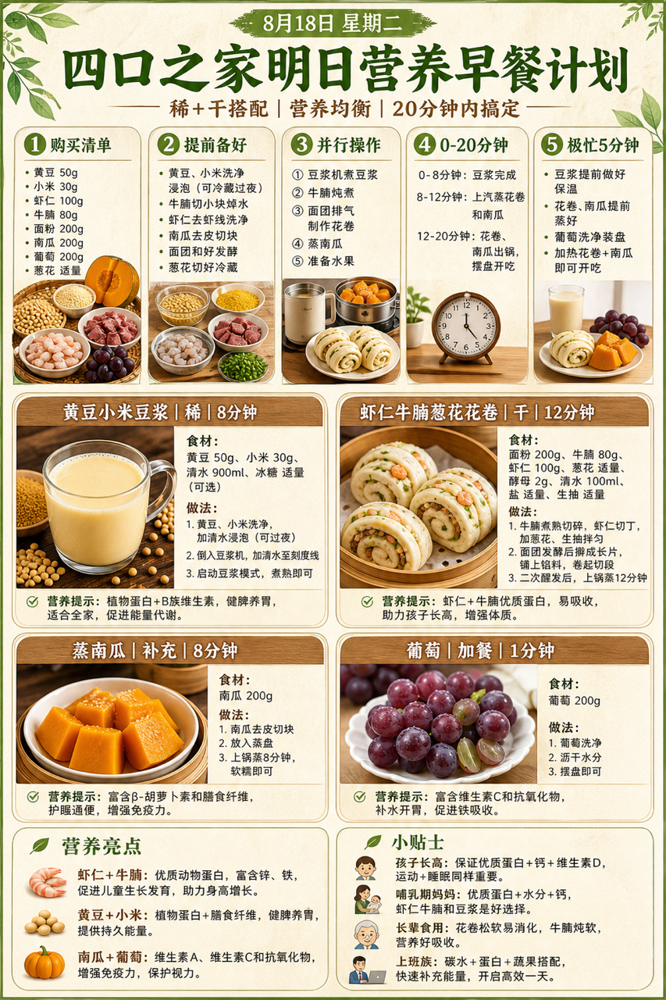
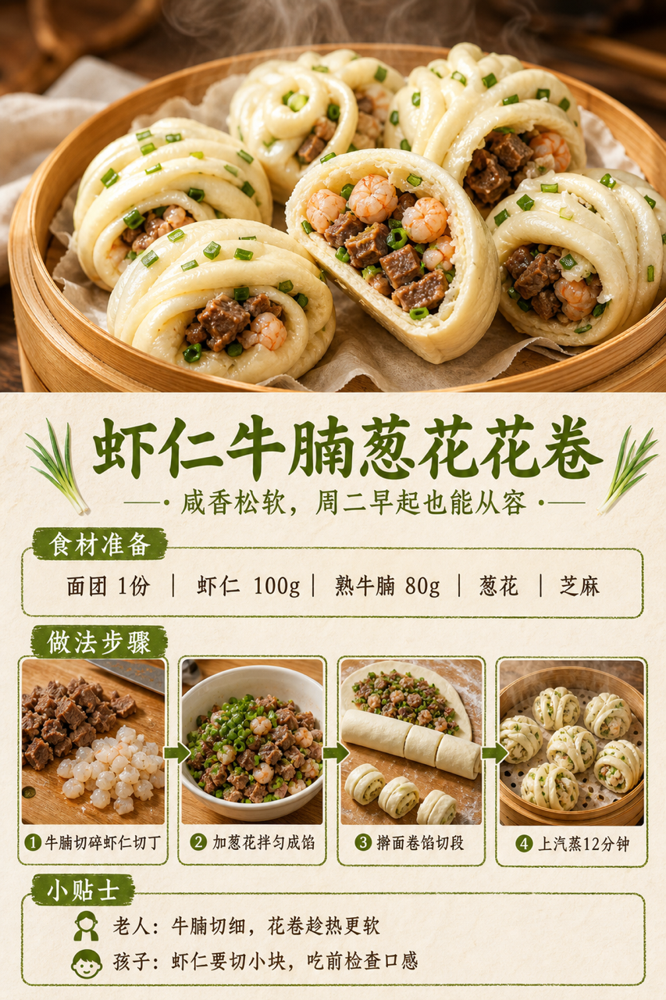

# 2026-08-18 四口之家早餐内容包

## 小红书标题

跟着 Tiny.C 吃30天早餐｜第45天｜四口之家20分钟豆浆早餐

## 小红书正文

第45天做清新绿豆浆早餐：黄豆小米豆浆配虾仁牛腩葱花花卷，再加蒸南瓜和葡萄。晚上黄豆小米泡好、熟牛腩切丁、虾仁解冻，花卷卷好冷藏；早上豆浆机开煮，花卷上锅蒸、同步蒸南瓜，20分钟上桌。虾仁和牛腩补蛋白与铁，黄豆小米更顶饱；老人花卷趁热更软，孩子虾仁切小块。极忙时冷冻花卷配热豆浆，5分钟完成。关注我，明早继续抄作业。

## 流量标签

#早餐 #儿童早餐 #家庭早餐 #长高早餐 #四口之家早餐 #格力高扁桃仁效果 #蜜雪冰城 #🌀旺仔饿了🌀 #小林和小嗝的家常 #吃货老外铁蛋儿

## 互动问题

明天我做4个版本：A. 小学生长高版 B. 老人好消化版 C. 上班族快手版 D. 评论区留下你专属版。你家更需要哪个？评论 A/B/C/D，我按票数发；选 D 的直接留下年龄、家庭人数、忌口和早上可用时间。

## 置顶评论

想要「7天不重样早餐表」的，评论“7天”。选 D 的留下年龄、家庭人数、忌口和早上可用时间，我会挑典型家庭做专属版，后面每天更新。

## 明天预告

明天预告：三文鱼小米粥配芝麻烧饼，孩子长高高钙版。

## 发布状态

`ready_for_review`；未发布，仅供人工确认。

## 热词台账

[查看本周热词台账](weekly-hot-tags.json)

## 配图预览

1. 真实家庭餐桌早餐成品图

2. 清新绿色高信息密度早餐总览信息图

3. 虾仁牛腩葱花花卷制作过程图

## 发布描述

建议人工审核后于早间早餐时段发布；按上述 1-3 顺序上传配图。标题、正文、标签、互动问题、置顶评论与明天预告均已同步至本页；本内容包不执行自动发布。
