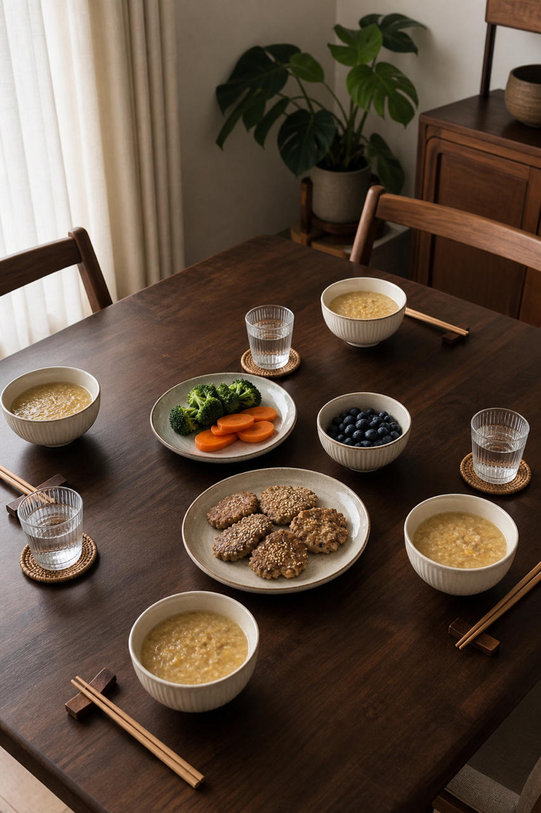
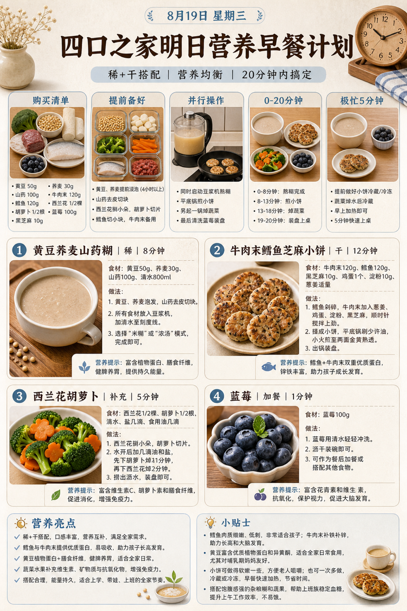
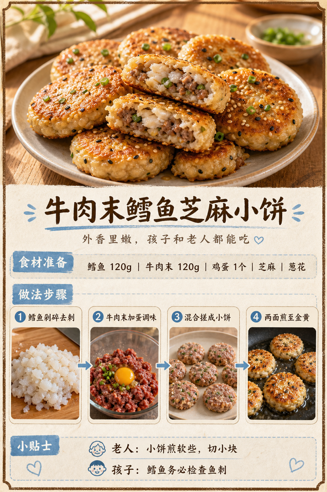

# 2026-08-19 四口之家早餐内容包

## 小红书标题

跟着 Tiny.C 吃30天早餐｜第46天｜四口之家20分钟杂粮糊早餐

## 小红书正文

第46天做浅蓝杂粮糊早餐：黄豆荞麦山药糊配牛肉末鳕鱼芝麻小饼，再加西兰花胡萝卜和蓝莓。晚上黄豆荞麦泡好、山药去皮冷藏，鳕鱼去刺、牛肉末调味；早上豆浆机开煮，小饼平底锅煎、同步焯蔬菜，20分钟上桌。鳕鱼牛肉补优质蛋白和铁，黄豆荞麦更顶饱；老人小饼煎软切小，孩子鱼刺再检查。极忙时冷藏小饼复热配杂粮糊，5分钟完成。关注我，明早继续抄作业。

## 流量标签

#早餐 #儿童早餐 #家庭早餐 #长高早餐 #四口之家早餐 #谢谢侬陈森 #吃货老外铁蛋儿 #公司顶凉柱 #佳减乘除 #🌀旺仔饿了🌀

## 互动问题

明天我做4个版本：A. 小学生长高版 B. 老人好消化版 C. 上班族快手版 D. 评论区留下你专属版。你家更需要哪个？评论 A/B/C/D，我按票数发；选 D 的直接留下年龄、家庭人数、忌口和早上可用时间。

## 置顶评论

想要「7天不重样早餐表」的，评论“7天”。选 D 的留下年龄、家庭人数、忌口和早上可用时间，我会挑典型家庭做专属版，后面每天更新。

## 明天预告

明天预告：鲜虾玉米蒸蛋配红薯饼，孩子长高软嫩版。

## 发布状态

`ready_for_review`；未发布，仅供人工确认。

## 热词台账

[查看本周热词台账](weekly-hot-tags.json)

## 配图预览

1. 真实家庭餐桌早餐成品图

2. 浅蓝强调色高信息密度早餐总览信息图

3. 牛肉末鳕鱼芝麻小饼制作过程图

## 发布描述

建议人工审核后于早间早餐时段发布；按上述 1-3 顺序上传配图。标题、正文、标签、互动问题、置顶评论与明天预告均已同步至本页；本内容包不执行自动发布。
