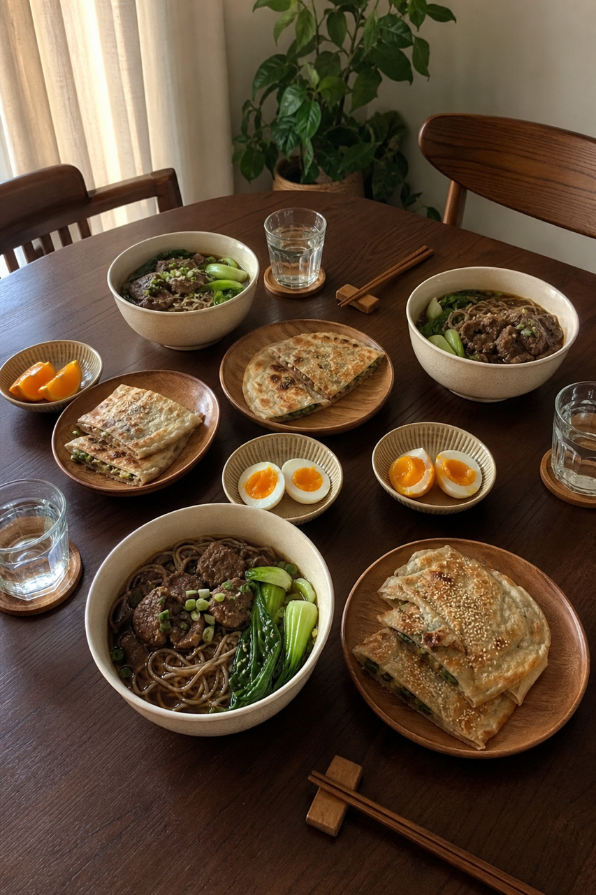
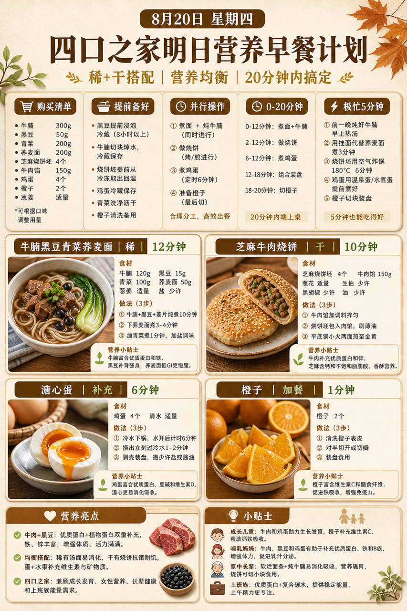
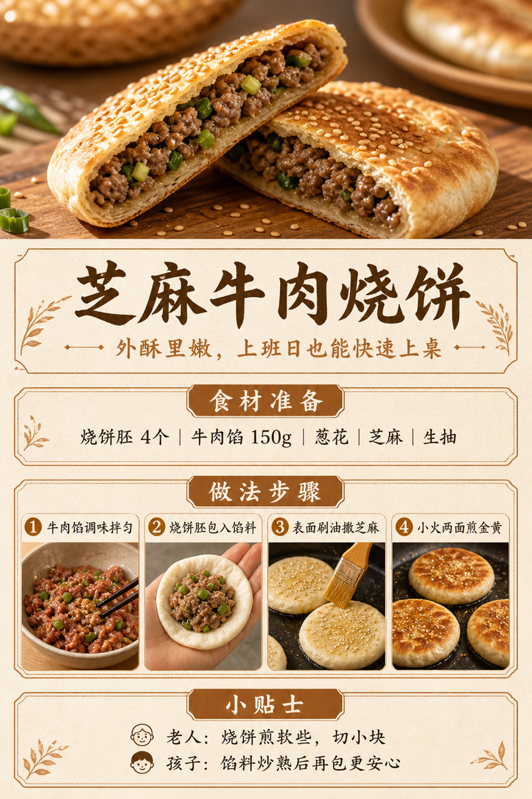

# 2026-08-20 四口之家早餐内容包

## 小红书标题

跟着 Tiny.C 吃30天早餐｜第47天｜四口之家20分钟牛肉面早餐

## 小红书正文

第47天做秋日暖棕牛肉面早餐：牛腩黑豆青菜荞麦面配芝麻牛肉烧饼，再加溏心蛋和橙子。晚上黑豆泡好、牛腩炖熟切块、烧饼胚冷藏；早上面条煮12分钟，烧饼平底锅煎、鸡蛋定时煮，20分钟上桌。牛腩和黑豆补蛋白铁，荞麦面更顶饱；老人面煮软、烧饼切小，孩子烧饼馅炒熟更安心。极忙时热牛腩汤配烧饼，5分钟完成。关注我，明早继续抄作业。

## 流量标签

#早餐 #儿童早餐 #家庭早餐 #长高早餐 #四口之家早餐 #谢谢侬陈森 #吃货老外铁蛋儿 #小赵爱拍拍 #公司顶凉柱 #佳减乘除

## 互动问题

明天我做4个版本：A. 小学生长高版 B. 老人好消化版 C. 上班族快手版 D. 评论区留下你专属版。你家更需要哪个？评论 A/B/C/D，我按票数发；选 D 的直接留下年龄、家庭人数、忌口和早上可用时间。

## 置顶评论

想要「7天不重样早餐表」的，评论“7天”。选 D 的留下年龄、家庭人数、忌口和早上可用时间，我会挑典型家庭做专属版，后面每天更新。

## 明天预告

明天预告：豆腐虾仁蒸蛋配玉米窝窝头，老人也爱吃的软和版。

## 发布状态

`ready_for_review`；未发布，仅供人工确认。

## 热词台账

[查看本周热词台账](weekly-hot-tags.json)

## 配图预览

1. 真实家庭餐桌早餐成品图

2. 秋日暖棕高信息密度早餐总览信息图

3. 芝麻牛肉烧饼制作过程图

## 发布描述

建议人工审核后于早间早餐时段发布；按上述 1-3 顺序上传配图。标题、正文、标签、互动问题、置顶评论与明天预告均已同步至本页；本内容包不执行自动发布。
