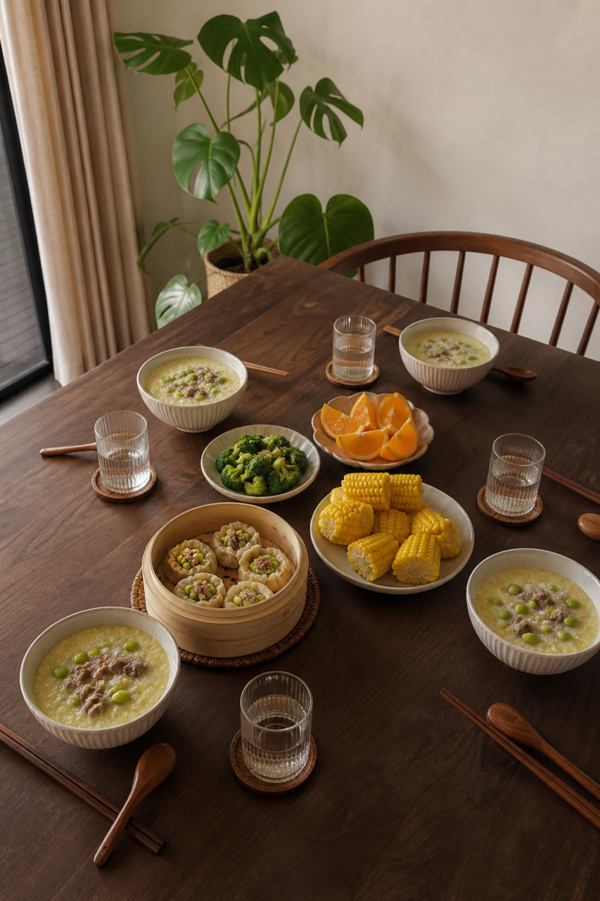
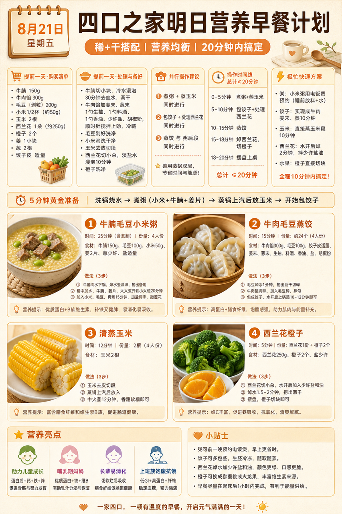
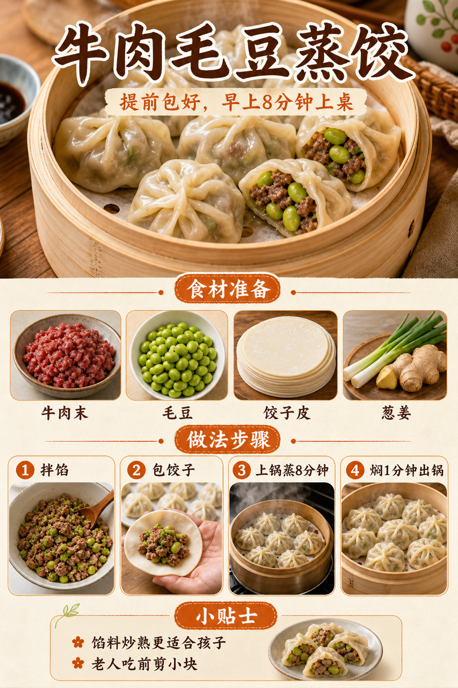

# 2026-08-21 四口之家早餐内容包

## 小红书标题

跟着 Tiny.C 吃30天早餐｜第48天｜四口之家20分钟蒸制早餐

## 小红书正文

第48天做奶油橙蒸制早餐：牛腩毛豆小米粥配牛肉毛豆蒸饺，蒸玉米和西兰花橙子一起上桌。前晚把牛腩切块煮熟、毛豆焯水、蒸饺包好冷冻；早上电饭煲热粥，蒸锅蒸饺和玉米，西兰花焯2分钟，20分钟完成。牛腩补铁、毛豆补蛋白，孩子吃蒸饺蘸少量醋；老人粥煮稠、蒸饺剪小，哺乳期多喝粥汤。极忙时加热冷冻蒸饺配剩粥，5分钟搞定。关注我，明早继续抄作业。

## 流量标签

#早餐 #儿童早餐 #家庭早餐 #长高早餐 #四口之家早餐 #谢谢侬陈森 #吃货老外铁蛋儿 #小赵爱拍拍 #公司顶凉柱 #佳减乘除

## 互动问题

明天我做4个版本：A. 小学生长高版 B. 老人好消化版 C. 上班族快手版 D. 评论区留下你专属版。你家更需要哪个？评论 A/B/C/D，我按票数发；选 D 的直接留下年龄、家庭人数、忌口和早上可用时间。

## 置顶评论

想要「7天不重样早餐表」的，评论“7天”。选 D 的留下年龄、家庭人数、忌口和早上可用时间，我会挑典型家庭做专属版，后面每天更新。

## 明天预告

明天预告：虾仁豆腐馄饨配紫薯小馒头，周末也能睡到自然醒的备餐版。

## 发布状态

`ready_for_review`；未发布，仅供人工确认。

## 热词台账

[查看本周热词台账](weekly-hot-tags.json)

## 配图预览

1. 真实家庭餐桌早餐成品图

2. 奶油橙高信息密度早餐总览信息图

3. 牛肉毛豆蒸饺制作过程图

## 发布描述

建议人工审核后于早间早餐时段发布；按上述 1-3 顺序上传配图。标题、正文、标签、互动问题、置顶评论与明天预告均已同步至本页；本内容包不执行自动发布。
