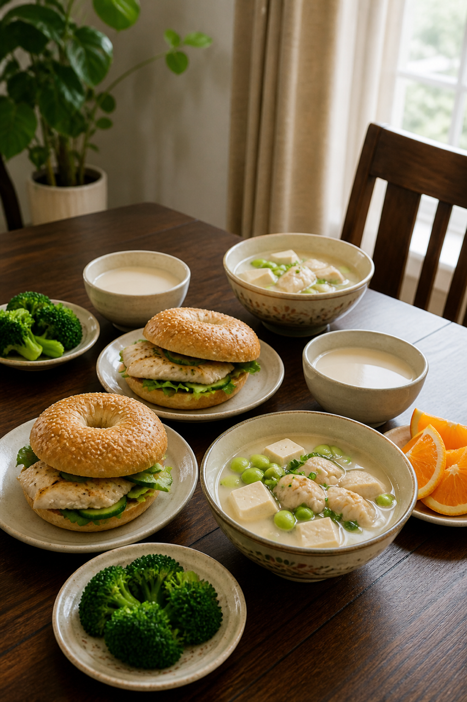
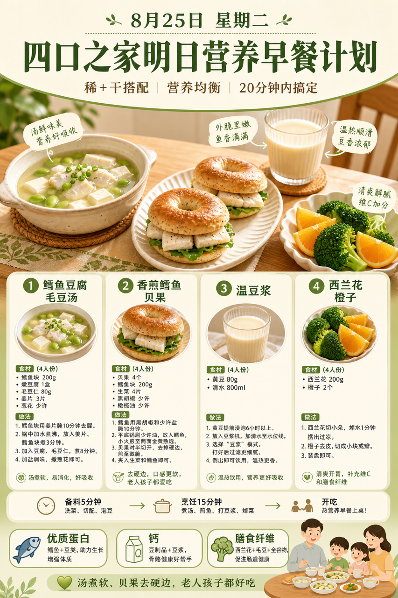
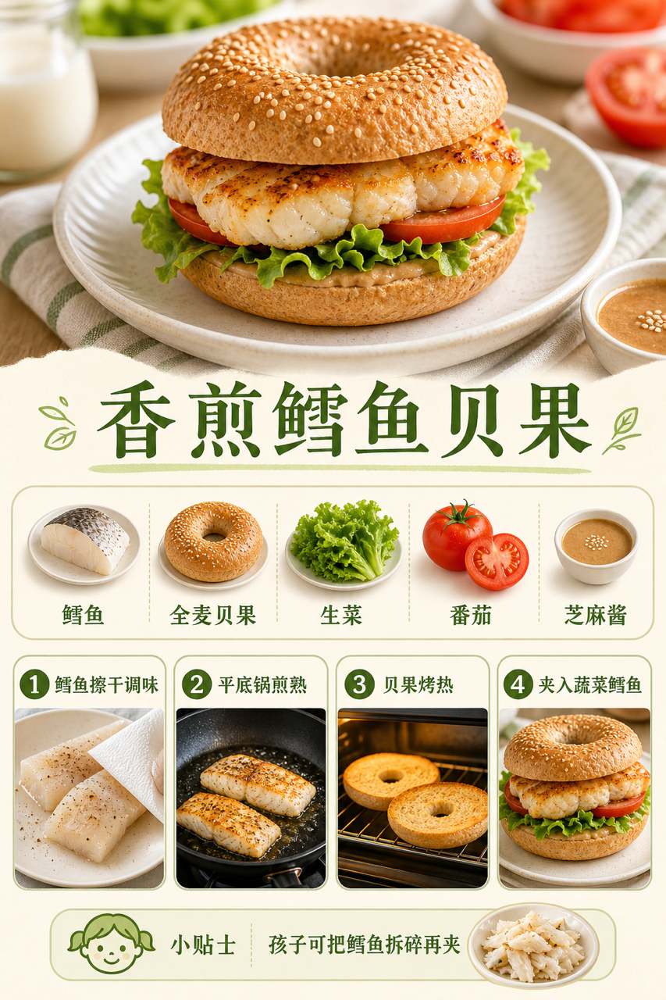

# 2026-08-25 四口之家早餐内容包

## 小红书标题

跟着 Tiny.C 吃30天早餐｜第50天｜四口之家20分钟贝果早餐

## 小红书正文

第50天做清新绿色贝果早餐：鳕鱼豆腐毛豆汤配香煎鳕鱼贝果，再加温豆浆和西兰花橙子。前晚鳕鱼分装冷藏、毛豆焯熟、豆腐切块，贝果对半冷冻；早上汤煮10分钟，鳕鱼平底锅煎、贝果烤热，20分钟上桌。鳕鱼和豆腐补优质蛋白与钙，孩子把鳕鱼拆碎夹进贝果；老人汤煮软、贝果去硬边，哺乳期多喝豆浆。极忙时热汤配现成贝果，5分钟完成。关注我，明早继续抄作业。

## 流量标签

#早餐 #儿童早餐 #家庭早餐 #长高早餐 #四口之家早餐 #阿蔡美食教学 #吃货老外铁蛋儿 #炸毛澈 #奈雪的茶 #谢谢侬陈森

## 互动问题

明天我做4个版本：A. 小学生长高版 B. 老人好消化版 C. 上班族快手版 D. 评论区留下你专属版。你家更需要哪个？评论 A/B/C/D，我按票数发；选 D 的直接留下年龄、家庭人数、忌口和早上可用时间。

## 置顶评论

想要「7天不重样早餐表」的，评论“7天”。选 D 的留下年龄、家庭人数、忌口和早上可用时间，我会挑典型家庭做专属版，后面每天更新。

## 明天预告

明天预告：鸡丝玉米粥配葱油小花卷，老人也爱吃的软和版。

## 发布状态

`ready_for_review`；未发布，仅供人工确认。

## 热词台账

[查看本周热词台账](weekly-hot-tags.json)

## 配图预览

1. 真实家庭餐桌早餐成品图

2. 清新绿色高信息密度早餐总览信息图

3. 香煎鳕鱼贝果制作过程图

## 发布描述

建议人工审核后于早间早餐时段发布；按上述 1-3 顺序上传配图。标题、正文、标签、互动问题、置顶评论与明天预告均已同步至本页；本内容包不执行自动发布。
