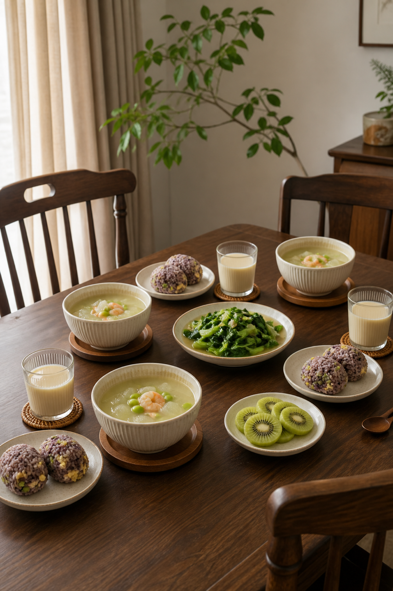
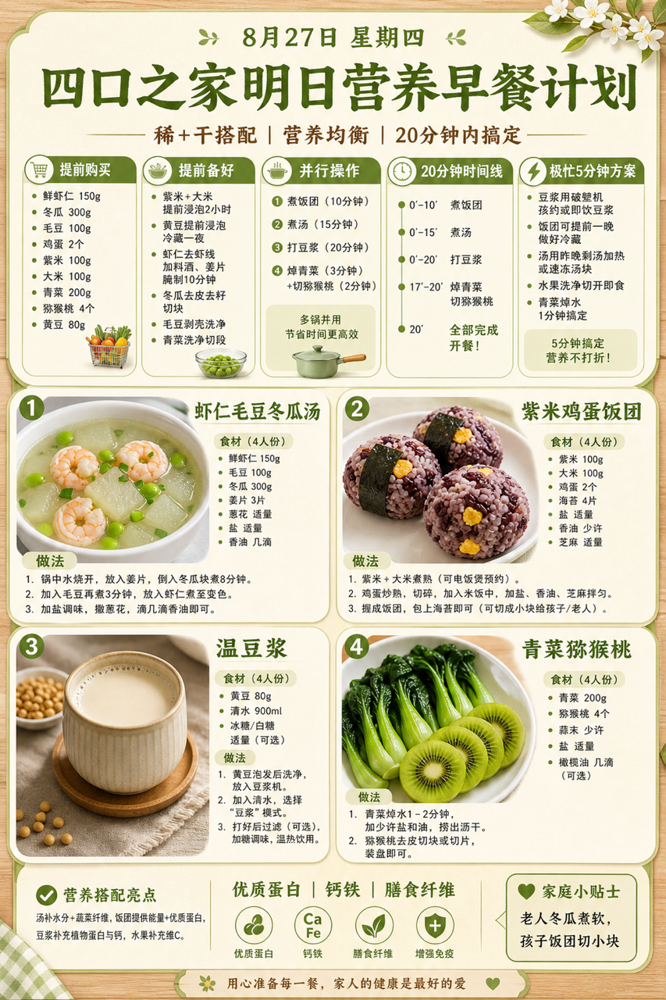
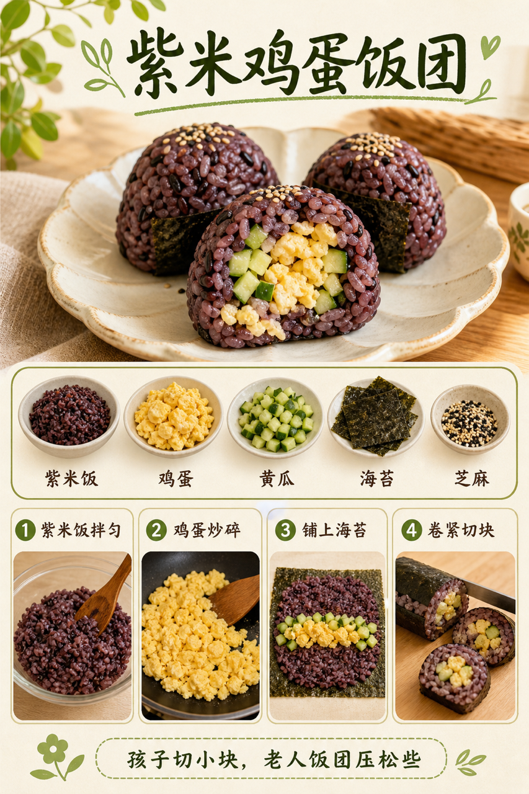

# 2026-08-27 四口之家早餐内容包

## 小红书标题

跟着 Tiny.C 吃30天早餐｜第52天｜四口之家20分钟饭团早餐

## 小红书正文

第52天做春日绿色饭团早餐：虾仁毛豆冬瓜汤配紫米鸡蛋饭团，加温豆浆和青菜猕猴桃。前晚紫米煮好冷藏、虾仁去线分装、毛豆焯熟、冬瓜切块；早上汤煮10分钟，鸡蛋炒碎拌紫米，海苔卷成饭团，20分钟上桌。虾仁和鸡蛋补优质蛋白，毛豆补钙，紫米更顶饱；孩子饭团切小块，老人冬瓜煮软少盐，哺乳期多喝温汤。极忙时用冷冻饭团加热、隔夜汤煮开，5分钟完成。关注我，明早继续抄作业。

## 流量标签

#早餐 #儿童早餐 #家庭早餐 #长高早餐 #四口之家早餐 #麦当劳 #申申椰 #食堂历史 #蜜雪冰城 #林述巍-林大厨

## 互动问题

明天我做4个版本：A. 小学生长高版 B. 老人好消化版 C. 上班族快手版 D. 评论区留下你专属版。你家更需要哪个？评论 A/B/C/D，我按票数发；选 D 的直接留下年龄、家庭人数、忌口和早上可用时间。

## 置顶评论

想要「7天不重样早餐表」的，评论“7天”。选 D 的留下年龄、家庭人数、忌口和早上可用时间，我会挑典型家庭做专属版，后面每天更新。

## 明天预告

明天预告：番茄牛肉乌冬面配玉米小饼，上班族快手版。

## 发布状态

`ready_for_review`；未发布，仅供人工确认。

## 热词台账

[查看本周热词台账](weekly-hot-tags.json)

## 配图预览

1. 真实家庭餐桌早餐成品图

2. 春日绿色高信息密度早餐总览信息图

3. 紫米鸡蛋饭团制作过程图

## 发布描述

建议人工审核后于早间早餐时段发布；按上述 1-3 顺序上传配图。标题、正文、标签、互动问题、置顶评论与明天预告均已同步至本页；本内容包不执行自动发布。
