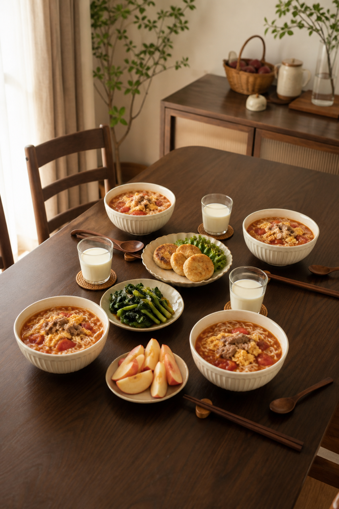
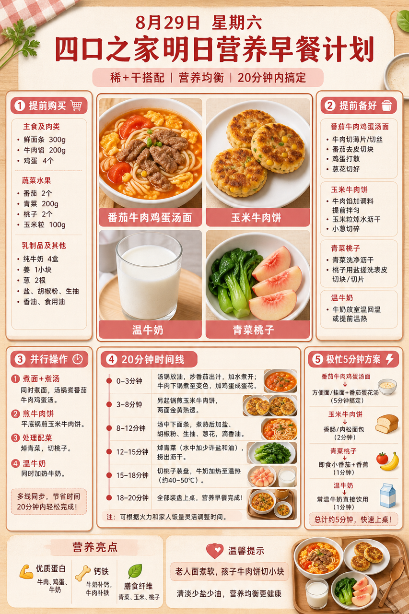
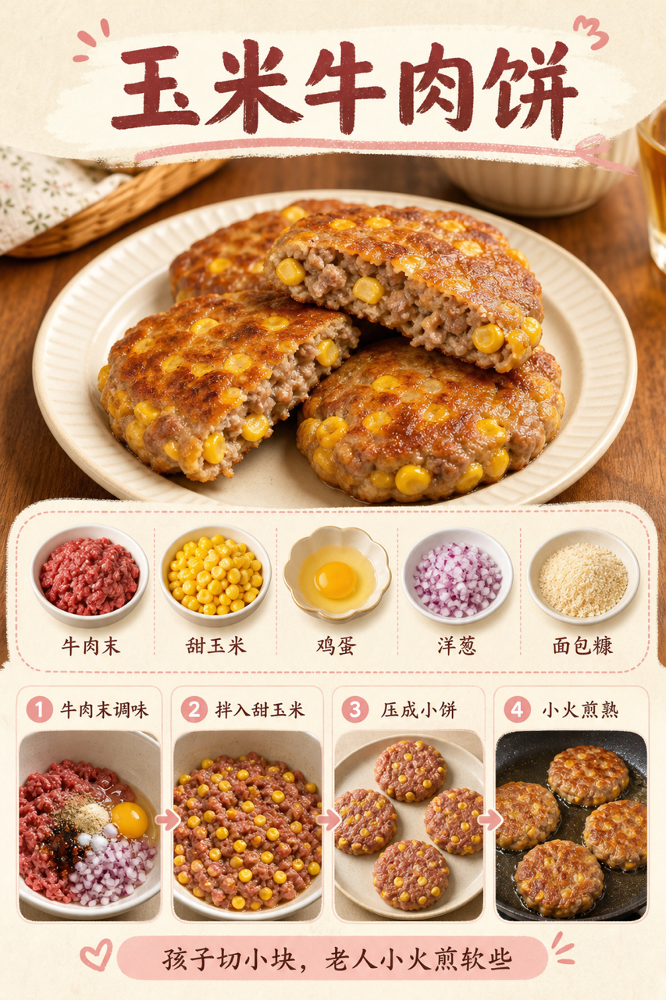

# 2026-08-29 四口之家早餐内容包

## 小红书标题

番茄鸡蛋面配牛肉饼，20分钟

## 小红书正文

第53天做豆沙粉汤面早餐：番茄牛肉鸡蛋汤面配玉米牛肉饼，加温牛奶和青菜桃子。前晚牛肉切薄片、番茄切块、玉米粒焯熟，牛肉饼拌好冷藏；早上汤面煮10分钟，另一口锅小火煎饼，20分钟上桌。牛肉和鸡蛋补优质蛋白与铁，牛奶补钙；孩子面剪短、牛肉饼切小块，老人面煮软少油，哺乳期多喝汤加牛奶。极忙时番茄蛋面配冷冻牛肉饼加热，5分钟完成。关注我，明早继续抄作业。

## 流量标签

#轻亚入门 #我的神级复刻 #我的不完美料理 #野生向导体验howto #万物非虚构 #镜头是爱意的具象化 #存肌肉就是存未来 #世界是我的兴趣班 #中秋节 #全国爱牙日

来自本地 Top10 话题台账。[话题台账](weekly-hot-tags.json) · [来源快照](../../hot-topics/2026-09-15.md)

## 互动问题

明天我做4个版本：A. 小学生长高版 B. 老人好消化版 C. 上班族快手版 D. 评论区留下你专属版。你家更需要哪个？评论 A/B/C/D，我按票数发；选 D 的直接留下年龄、家庭人数、忌口和早上可用时间。

## 置顶评论

想要「7天不重样早餐表」的，评论“7天”。选 D 的留下年龄、家庭人数、忌口和早上可用时间，我会挑典型家庭做专属版，后面每天更新。

## 明天预告

明天预告：山药小米粥配鲜虾小包子，周末软和高蛋白版。

## 发布状态

`ready_for_review`；未发布，仅供人工确认。

## 热词台账

[查看本周热词台账](weekly-hot-tags.json)

## 配图预览

1. 真实家庭餐桌早餐成品图

2. 豆沙粉高信息密度早餐总览信息图

3. 玉米牛肉饼制作过程图

## 发布描述

建议人工审核后于早间早餐时段发布；按上述 1-3 顺序上传配图。标题、正文、标签、互动问题、置顶评论与明天预告均已同步至本页；本内容包不执行自动发布。
