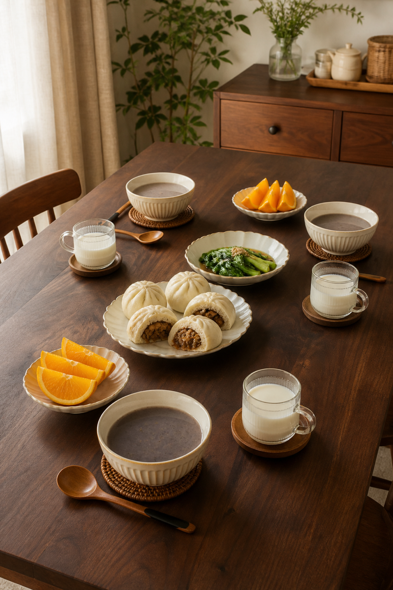
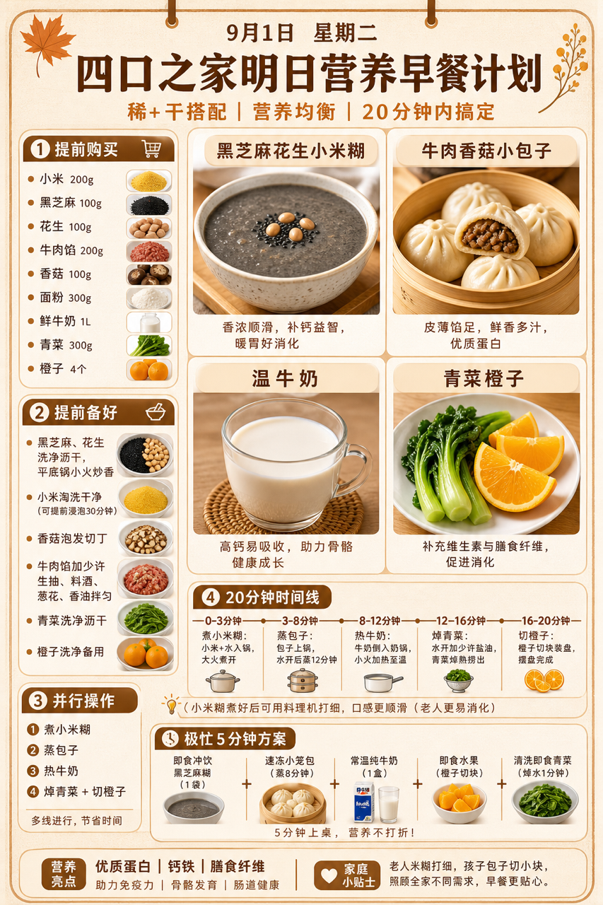
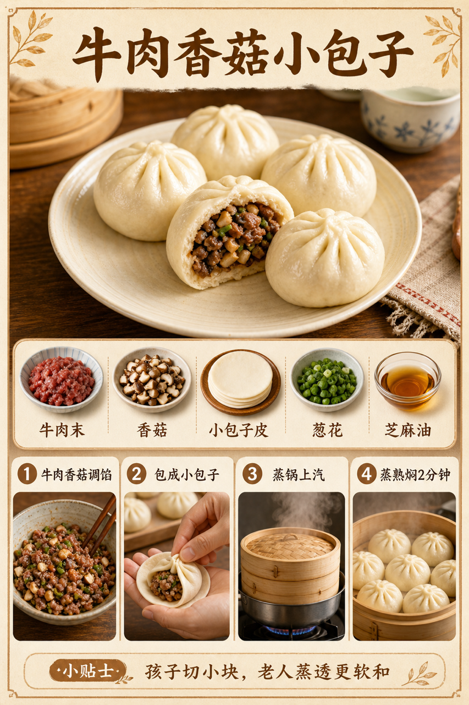

# 2026-09-01 四口之家早餐内容包

## 小红书标题

跟着 Tiny.C 吃30天早餐｜第54天｜四口之家20分钟杂粮糊早餐

## 小红书正文

第54天做秋日暖棕杂粮糊早餐：黑芝麻花生小米糊配牛肉香菇小包子，加温牛奶和青菜橙子。前晚黑芝麻花生炒香、小米洗净、牛肉香菇调馅冷藏；早上小米煮开后料理机打细，包子上汽蒸，青菜焯水，20分钟上桌。牛肉补蛋白和铁，芝麻花生补钙与好脂肪；孩子包子切小块，老人米糊打细、包子蒸透，哺乳期多喝温奶。极忙时即食芝麻糊配冷冻小包子，5分钟完成。关注我，明早继续抄作业。

## 流量标签

#早餐 #儿童早餐 #家庭早餐 #长高早餐 #四口之家早餐 #千金饱了 #日食记 #土呀土豆子 #发芽糖豆lumi #吃货老外铁蛋儿

## 互动问题

明天我做4个版本：A. 小学生长高版 B. 老人好消化版 C. 上班族快手版 D. 评论区留下你专属版。你家更需要哪个？评论 A/B/C/D，我按票数发；选 D 的直接留下年龄、家庭人数、忌口和早上可用时间。

## 置顶评论

想要「7天不重样早餐表」的，评论“7天”。选 D 的留下年龄、家庭人数、忌口和早上可用时间，我会挑典型家庭做专属版，后面每天更新。

## 明天预告

明天预告：鸡丝玉米粥配香煎豆腐卷，孩子长高的清淡版。

## 发布状态

`ready_for_review`；未发布，仅供人工确认。

## 热词台账

[查看本周热词台账](weekly-hot-tags.json)

## 配图预览

1. 真实家庭餐桌早餐成品图

2. 秋日暖棕高信息密度早餐总览信息图

3. 牛肉香菇小包子制作过程图

## 发布描述

建议人工审核后于早间早餐时段发布；按上述 1-3 顺序上传配图。标题、正文、标签、互动问题、置顶评论与明天预告均已同步至本页；本内容包不执行自动发布。
