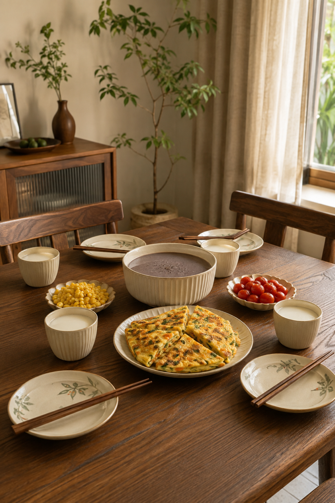
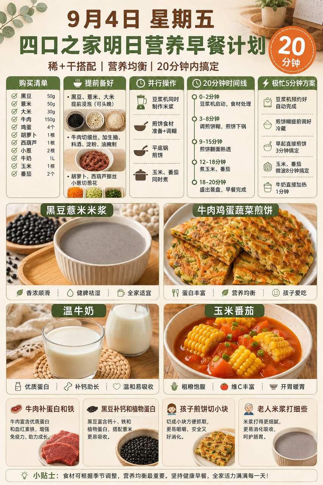
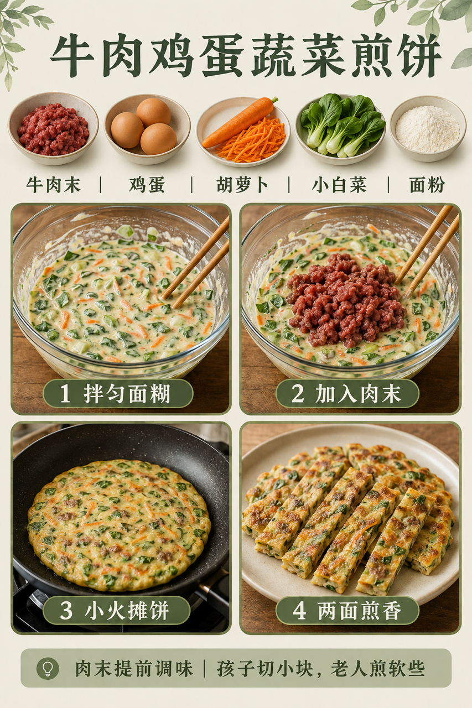

# 2026-09-04 四口之家早餐内容包

## 小红书标题

跟着 Tiny.C 吃30天早餐｜第57天｜四口之家20分钟煎饼早餐

## 小红书正文

第57天做莫兰迪绿煎饼早餐：黑豆薏米米浆配牛肉鸡蛋蔬菜煎饼，加温牛奶和玉米番茄。前晚黑豆薏米大米泡好，牛肉末调味、胡萝卜和小白菜切细；早上豆浆机打米浆，平底锅小火摊饼，玉米番茄同煮，20分钟上桌。牛肉补蛋白和铁，黑豆补钙和植物蛋白，鸡蛋帮助长高；孩子煎饼切小块，老人米浆打细，哺乳期多喝温牛奶。极忙时提前摊饼冷藏复热，配即食黑豆浆，5分钟完成。关注我，明早继续抄作业。

## 流量标签

#早餐 #儿童早餐 #家庭早餐 #长高早餐 #四口之家早餐 #千金饱了 #土呀土豆子 #日食记 #小石奶凶 #一爸的厨房

## 互动问题

明天我做4个版本：A. 小学生长高版 B. 老人好消化版 C. 上班族快手版 D. 评论区留下你专属版。你家更需要哪个？评论 A/B/C/D，我按票数发；选 D 的直接留下年龄、家庭人数、忌口和早上可用时间。

## 置顶评论

想要「7天不重样早餐表」的，评论“7天”。选 D 的留下年龄、家庭人数、忌口和早上可用时间，我会挑典型家庭做专属版，后面每天更新。

## 明天预告

明天预告：鲜虾海带小馄饨配芝麻红薯卷，周末也不赖床的暖胃版。

## 发布状态

`ready_for_review`；未发布，仅供人工确认。

## 热词台账

[查看本周热词台账](weekly-hot-tags.json)

## 配图预览

1. 真实家庭餐桌早餐成品图

2. 莫兰迪色系高信息密度早餐总览信息图

3. 牛肉鸡蛋蔬菜煎饼制作过程图

## 发布描述

建议人工审核后于早间早餐时段发布；按上述 1-3 顺序上传配图。标题、正文、标签、互动问题、置顶评论与明天预告均已同步至本页；本内容包不执行自动发布。
