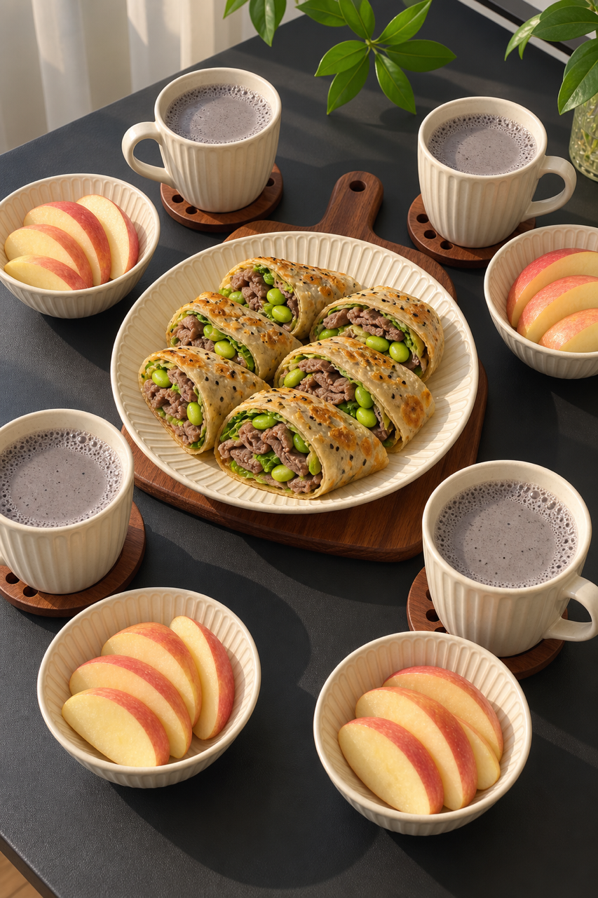
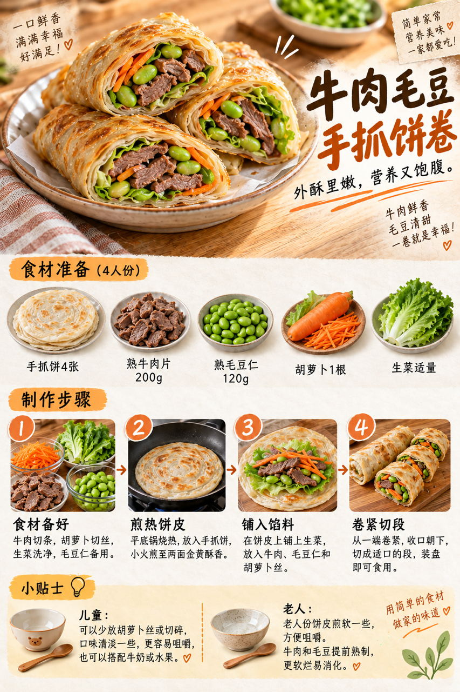

# 2026-09-08｜四口之家早餐

## 小红书标题

早八救星！牛肉手抓饼20分钟上桌

## 小红书正文

第61天，黑豆核桃豆浆配牛肉毛豆手抓饼卷，再添温牛奶和苹果。前晚泡好黑豆、备好熟牛肉和毛豆，早上打豆浆与煎饼并行，20分钟热乎上桌。孩子那份切小段，老人那份饼皮煎软。极忙时换即饮黑豆豆浆、即食牛肉手抓饼和苹果，5分钟也能开饭。关注我，明早继续抄作业。

## 流量标签

#2026秋日重启计划 #中式辣感 #民间remake智慧 #我的不完美料理 #适我主义 #教师节 #中秋节 #秋分 #活人感与反精致 #抽象梗文化与情绪共鸣

来自本地 Top10 话题台账。[话题台账](weekly-hot-tags.json) · [来源快照](../../hot-topics/2026-09-11.md)

## 互动问题

你家更需要哪个版本？A. 小学生长高版 B. 老人好消化版 C. 上班族快手版 D. 评论区留下你专属版。评论 A/B/C/D；选 D 的留下年龄、家庭人数、忌口和早上可用时间。

## 置顶评论

想要「7天不重样早餐表」的，评论“7天”。选 D 的留下年龄、家庭人数、忌口和早上可用时间，我会挑典型家庭做专属版，关注后续更新。

## 明天预告

明天预告：鲜虾豆腐蒸蛋配紫米饭团，20分钟软和早餐。

## 发布状态

已于 2026-09-14 18:09（Asia/Shanghai）通过独立 Chrome 发布成功。页面明确显示“发布成功”；内容包仍保留生成状态 status=ready_for_review、should_publish=false、is_original=true。

## 菜单与制作安排

四人份，预算约40元，按食量调整。

- 黑豆核桃豆浆：黑豆200g、核桃100g、水约1.2L。
- 牛肉毛豆手抓饼卷：手抓饼4张、熟牛肉片250g、熟毛豆仁200g、生菜适量、胡萝卜1根。煎热饼皮，铺入熟牛肉、熟毛豆、生菜和胡萝卜后卷紧切段。
- 温牛奶：800ml。
- 苹果片：苹果4个，可按食量减量。

前晚：浸泡黑豆；熟牛肉切片、毛豆煮熟、胡萝卜切丝，分别密封冷藏。

- 0–5分钟：黑豆和核桃放入豆浆机快打，同时取出熟牛肉、毛豆和配菜。
- 5–15分钟：平底锅煎热手抓饼，铺入牛肉、毛豆、生菜和胡萝卜后卷起。
- 15–18分钟：手抓饼卷切段，温热牛奶。
- 18–20分钟：切苹果、倒豆浆、分餐。

极忙5分钟：即饮黑豆豆浆＋按包装说明复热即食牛肉手抓饼＋苹果，约5分钟；不把生肉烹饪算作5分钟方案。

## 发布描述

补生成内容数据。发布时按3张图顺序上传，逐项回读标题正文并逐个绑定可识别话题；本次不执行网页发布。

[内容包](content-package.json) · [发布记录](publication.json) · [发布结果截图](publication-result.png) · [图片提示词](image-prompts.md) · [餐桌参考](../../../assets/image1_example/image_5eb39cb3.jpg)

## 配图

### 图1

[下载原图](01-family-table.png)

### 图2

[下载原图](02-breakfast-overview.png)

### 图3

[下载原图](03-beef-edamame-pancake-process.png)
