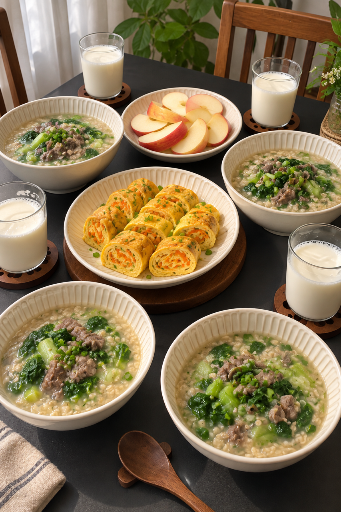
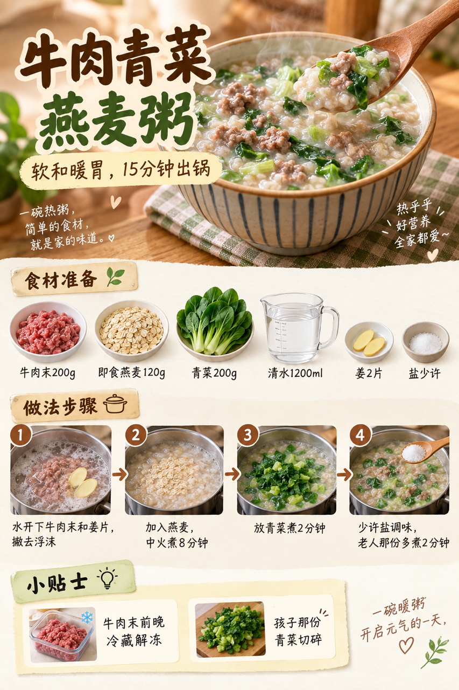

# 2026-09-10｜四口之家早餐

## 小红书标题

有手就会！这锅牛肉粥全家都爱

## 小红书正文

第63天，牛肉青菜燕麦粥配胡萝卜鸡蛋卷，再添热牛奶和苹果。前晚把牛肉末冷藏解冻、青菜洗好，早上煮粥和煎蛋卷并行，20分钟热乎上桌。孩子那份青菜切碎，老人那份多煮2分钟。极忙时换即食燕麦牛奶、熟鸡蛋和苹果，5分钟也能开饭。关注我，明早继续抄作业。

## 流量标签

#2026秋日重启计划 #中式辣感 #民间remake智慧 #我的不完美料理 #适我主义 #教师节 #中秋节 #秋分 #活人感与反精致 #抽象梗文化与情绪共鸣

来源于工作区最近日期的本地 Top10 精选，不等同于独立验证的官方热榜。[话题台账](weekly-hot-tags.json) · [来源快照](../../hot-topics/2026-09-11.md)

## 互动问题

你家更需要哪个版本？A. 小学生长高版 B. 老人好消化版 C. 上班族快手版 D. 评论区留下你专属版。评论 A/B/C/D；选 D 的留下年龄、家庭人数、忌口和早上可用时间。

## 置顶评论

想要「7天不重样早餐表」的，评论“7天”。选 D 的留下年龄、家庭人数、忌口和早上可用时间，我会挑典型家庭做专属版，关注后续更新。

## 明天预告

明天预告：番茄虾仁青菜汤面配芝麻馒头片，20分钟汤面早餐。

## 发布状态

待网页发布。内容包 status=ready_for_review；should_publish=false；is_original=true。发布结果以 [publication.json](publication.json) 为准（发布前尚未创建）。

## 菜单与制作安排

四人份，预算约42元，按食量调整。

- 牛肉青菜燕麦粥：牛肉末200g、即食燕麦120g、青菜200g、姜2片、水约1.2L、盐少许。
- 胡萝卜鸡蛋卷：鸡蛋4个、胡萝卜1根、葱花少许、油少许。
- 热牛奶：800ml。
- 苹果片：苹果2个。

前晚：牛肉末放冷藏解冻；青菜洗净沥干冷藏；胡萝卜擦丝密封冷藏。

- 0–2分钟：准备食材，热锅烧水。
- 2–15分钟：煮牛肉青菜燕麦粥，同时煎胡萝卜鸡蛋卷。
- 15–18分钟：温牛奶、切苹果。
- 18–20分钟：分餐上桌。

极忙5分钟：即食燕麦加热牛奶，配熟鸡蛋和苹果；不把生肉或生蛋的烹饪算作5分钟方案。

## 发布描述

按图1家庭餐桌、图2早餐总览、图3粥品步骤的顺序上传。标题与正文分别填写，10个话题必须逐个输入并确认被表单识别；可见范围保持公开。仅发布帖子，置顶评论不随本次自动发布提交。

[内容包](content-package.json) · [餐桌参考](../../../assets/image1_example/image_5eb39cb3.jpg)

## 配图

### 图1｜家庭餐桌

[下载原图](01-family-table.png)

### 图2｜早餐总览

[下载原图](02-breakfast-overview.png)

### 图3｜牛肉青菜燕麦粥步骤

[下载原图](03-beef-oat-porridge-process.png)
