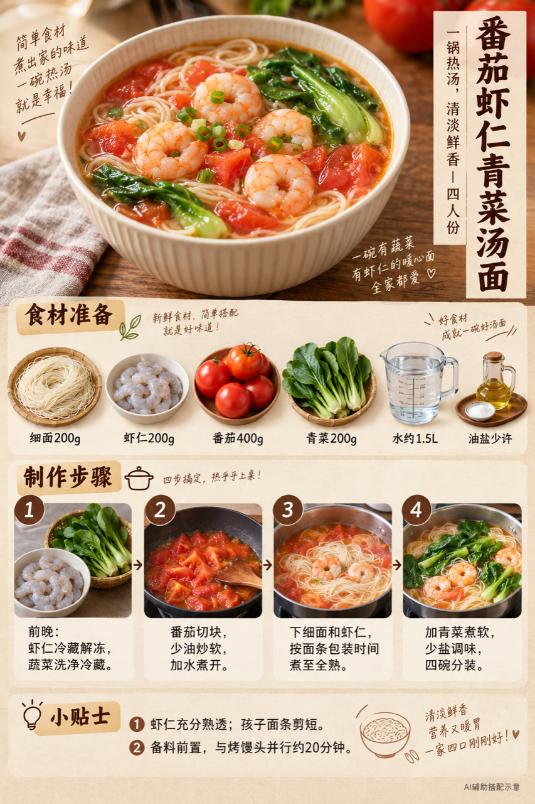

# 2026-09-11｜四口之家早餐

## 小红书标题

跟着 Tiny.C 吃30天早餐｜第64天｜四口之家20分钟汤面早餐

## 小红书正文

第64天，番茄虾仁青菜汤面配芝麻馒头片，再添牛奶和梨。前晚解冻虾仁、洗好蔬菜，早上煮面和烤馒头并行，约20分钟上桌。孩子面条剪短，老人那份煮软。极忙时换即食面包、牛奶、熟鸡蛋和水果，5分钟也能开饭。关注我，明早继续抄作业。配图为AI辅助搭配示意。

## 流量标签

#周末去哪儿 #亲子旅行 #早餐不重样 #显瘦穿搭 #美妆分享 #家常菜 #在家做饭 #今天吃什么 #休闲穿搭 #快手早餐

随机生成，非已验证热词。[随机话题台账](weekly-hot-tags.json)

## 互动问题

你家更需要哪个版本？A. 小学生早餐版 B. 老人软和版 C. 上班族快手版 D. 评论区留下你专属版。评论 A/B/C/D；选 D 的留下年龄、家庭人数、忌口和早上可用时间。

## 置顶评论

想要「7天不重样早餐表」的，评论“7天”。选 D 的留下家庭人数、年龄、忌口和早上可用时间，我会挑典型家庭做专属版，关注后续更新。

## 明天预告

明天预告：山药燕麦糊配牛肉土豆饼，周末软和早餐版。

## 发布状态

未发布，仅生成待人工确认内容。status=ready_for_review；should_publish=false；is_original=true。配图为AI辅助生成。

## 菜单与制作安排

四人份，预算约40元，按食量调整。

- 番茄虾仁青菜汤面：细面200g、虾仁200g、番茄400g、青菜200g、水约1.5L、油盐少许。
- 芝麻烤馒头片：馒头2个、芝麻少许、油少许。薄切，刷油撒芝麻，180℃烤约8分钟，按设备调整；老人可改蒸软。
- 温牛奶：800ml。
- 梨片：梨1个。

前晚：前晚虾仁冷藏解冻，蔬菜洗净沥干冷藏，馒头切片。

- 0–5分钟：炒软番茄，加水煮开，同时开始烤馒头片。
- 5–12分钟：下细面和虾仁，按面条包装时间煮至全熟。
- 12–15分钟：加青菜煮软，少盐调味。
- 15–20分钟：温奶、切梨、分餐。

极忙5分钟：即食全麦面包＋常温牛奶＋即食熟鸡蛋＋水果，约5分钟；不把生虾或生包子复热算作快速方案。

## 发布描述

仅供人工确认发布。3张图依次上传，正文与话题分别复制，标明AI辅助配图；置顶评论人工另发。目标日期为补生成，发布日期由人工决定。

[内容包](content-package.json) · [餐桌参考](../../../assets/image1_example/image_5eb39cb3.jpg)

## 配图

### 图1

[下载原图](01-family-table.png)

### 图2

[下载原图](02-breakfast-overview.png)

### 图3

[下载原图](03-tomato-shrimp-noodle-process.png)
