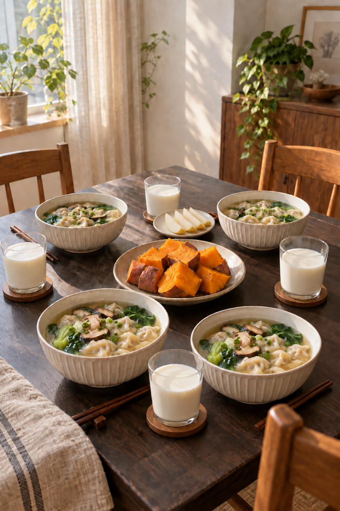
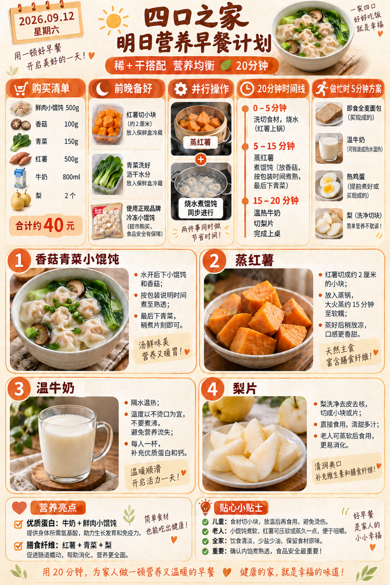
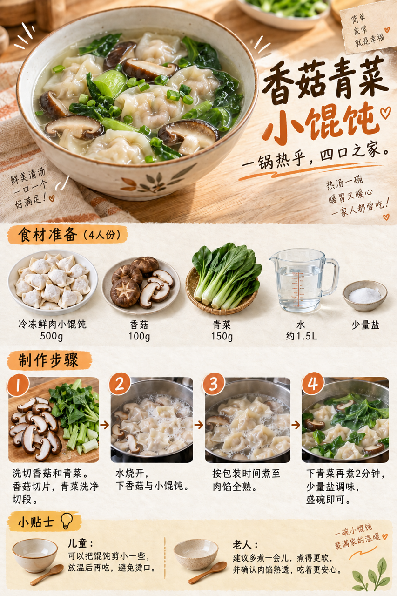

# 2026-09-12 早餐内容包

## 小红书标题

直接抄作业！周末这碗馄饨真省心

## 小红书正文

第65天，香菇青菜小馄饨配蒸红薯，再添温牛奶和梨。前晚洗好青菜、红薯切小块冷藏，早上蒸红薯和煮馄饨并行，约20分钟上桌。用正规冷冻鲜肉小馄饨，按包装时间煮至肉馅全熟；孩子剪小放温，老人煮软。极忙时换即食全麦面包、温奶、熟鸡蛋和梨，5分钟开饭。关注我，明早继续抄作业。

## 流量标签

#2026秋日重启计划 #中式辣感 #民间remake智慧 #我的不完美料理 #适我主义 #教师节 #中秋节 #秋分 #活人感与反精致 #抽象梗文化与情绪共鸣

## 互动问题

你家更需要哪个版本？A. 小学生长高版 B. 老人好消化版 C. 上班族快手版 D. 评论区留下你专属版。评论 A/B/C/D；选 D 的留下年龄、家庭人数、忌口和早上可用时间。

## 置顶评论

想要「7天不重样早餐表」的，评论“7天”。选 D 的留下年龄、家庭人数、忌口和早上可用时间，我会挑典型家庭做专属版，关注后续更新。

## 明天预告

明天预告：山药燕麦糊配虾仁玉米饼，周日软和早餐版。

## 发布状态

未发布；ready_for_review；should_publish=false。定时任务仅生成，不执行浏览器发布。

## 话题来源

来源日期：2026-09-11。仅本地精选，非独立核实官方热榜。[话题台账](weekly-hot-tags.json)。

## 配图

### 图1

[图片文件](01-family-table.png)

### 图2

[图片文件](02-breakfast-overview.png)

### 图3

[图片文件](03-wonton-process.png)

## 内容包与发布描述

[content-package.json](content-package.json)。仅生成未发布。图片依序为家庭餐桌、总览、制作过程；建议早餐时段人工审阅，发布须另行授权。
