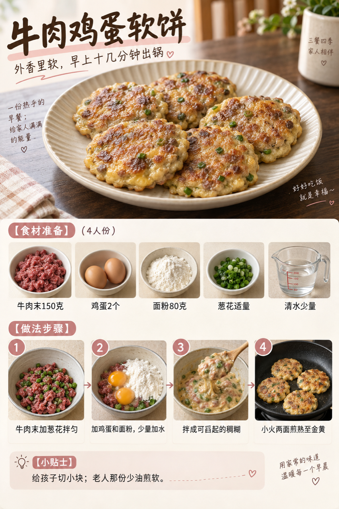
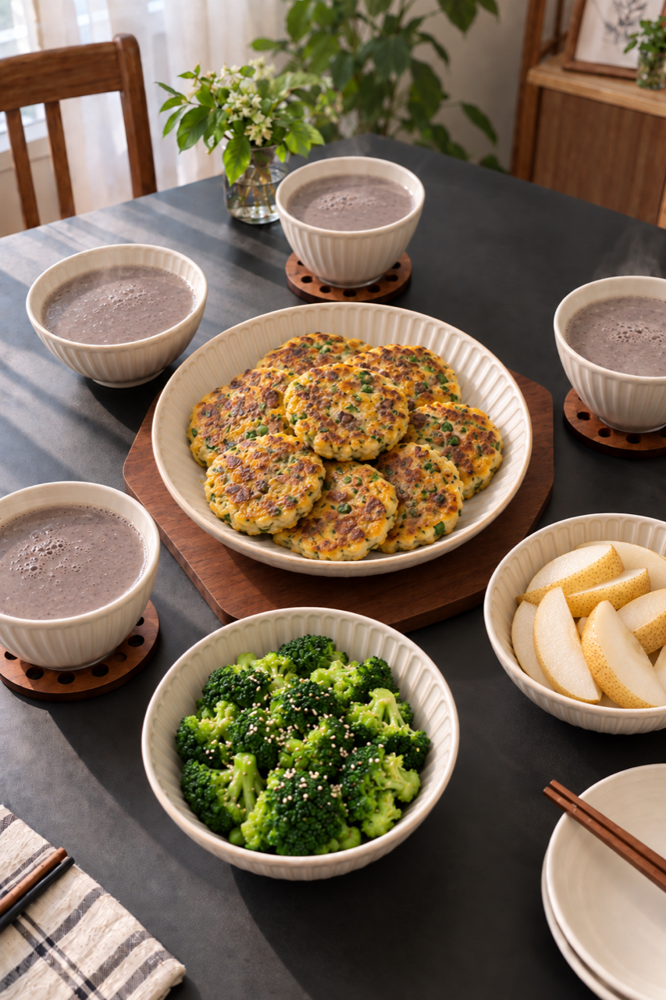
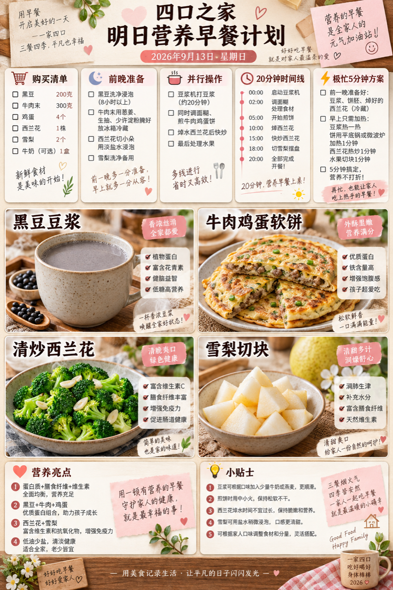

# 2026-09-13 早餐内容包

## 小红书标题

直接抄！黑豆浆配牛肉软饼

## 小红书正文

四口之家这顿黑豆豆浆配牛肉鸡蛋软饼，再添西兰花和雪梨。前晚预约豆浆、牛肉末分装；早上煎软饼时焯西兰花、切梨，20分钟上桌。牛肉和鸡蛋补蛋白，老人份少油煎软，女儿份切小块。极忙时热豆浆配熟蛋和馒头，5分钟也能吃上热乎的。关注我，明早继续抄作业。

## 流量标签

#秋分与丰收节 #中秋国庆双节 #中秋家宴 #月饼测评 #秋日时髦尖子生 #尸皮针争议 #松针大油边 #秋天的第一杯奶茶 #户外骑行解压 #这次旅行local一下

## 互动问题

明天我做 4 个版本：A. 小学生长高版 B. 老人好消化版 C. 上班族快手版 D. 评论区留下你专属版。你家更需要哪个？评论 A/B/C/D，我按票数发；选 D 的直接留下年龄、家庭人数、忌口和早上可用时间。关注我，明早直接抄作业。

## 置顶评论

想要「7天不重样早餐表」的，评论“7天”。选 D 的留下年龄、家庭人数、忌口和早上可用时间，我会挑典型家庭做专属版，后面每天更新。

## 明天预告

明天预告：南瓜燕麦小米糊配牛腩毛豆饭团。

## 菜单与备餐

- 黑豆豆浆：干黑豆80克、清水约1升；前晚浸泡后放豆浆机预约，晨起煮熟并保持温热；四人分杯。
- 牛肉鸡蛋软饼：牛肉末300克、鸡蛋4个、面粉160克、葱花适量、清水少量；分两批按每批牛肉末150克、鸡蛋2个、面粉80克调成稠糊；小火两面煎透至金黄。孩子份切小，老人份少油煎软。
- 清炒西兰花：西兰花300克、蒜片少许、食用油少量；西兰花切小朵焯熟后少油快炒；老人份切细。
- 雪梨切块：雪梨2个；流水洗净去核切块；孩子和老人按吞咽需要切小。

前晚准备：前晚浸泡黑豆并设置豆浆机预约；牛肉末分两份冷藏；西兰花洗净分朵；雪梨洗净。

20 分钟时间线：0–5分钟加热豆浆，调两份牛肉鸡蛋面糊并烧开焯菜水；5–15分钟平底锅小火分批煎软饼，同时焯熟西兰花；15–20分钟西兰花少油快炒、切雪梨、分杯摆盘。

极忙 5 分钟方案：温热无糖豆浆、前晚煮熟鸡蛋和现成馒头，5分钟。

## 发布状态

草稿已保存到专用 Codex-Breakfast-Chrome 中 Tiny.C 的本地图文草稿箱，保存时间 2026-09-23 06:26:25；未公开发布，也未发布评论。草稿仅存当前浏览器本地；后续请用同一登录 profile 手动检查并发布。记录与截图见 [draft.json](draft.json)、[保存前截图](draft-preflight.png)和[草稿箱核验截图](draft-verified.png)。

实际绑定 8 个原生话题：#中秋国庆双节、#中秋家宴、#月饼测评、#秋日时髦尖子生、#松针大油边、#秋天的第一杯奶茶、#户外骑行解压、#这次旅行local一下。#秋分与丰收节、#尸皮针争议未找到同名现有候选，未新建，也未保留未绑定文本。

## 话题来源

来源日期：2026-09-23。[话题台账](weekly-hot-tags.json)。本地精选，不等于已独立核实的官方热榜；补生成旧日期时按执行日时效检查并冻结来源。

## 配图

[图1文件](01-beef-egg-pancake-process.png)

[图2文件](02-family-table.png)

[图3文件](03-breakfast-overview.png)

## 内容包与发布描述

[content-package.json](content-package.json)。三张图片按顺序上传；标题、正文、互动问题和明天预告已写入草稿。内容包中的 10 个候选话题实际绑定 8 个、略过 2 个；置顶评论仅保留在内容包中，待用户手动发布后自行添加。

## 图片核验

三张图片均为 853×1280 px，由独立源图经 `remove-ai-watermarks all` 生成；`identify --json` 未检测到可识别可见水印或 metadata 信号。不可见水印阶段因缺少 GPU 依赖跳过，不据此宣称绝对无水印。详见 [watermark-verification.json](watermark-verification.json)。
