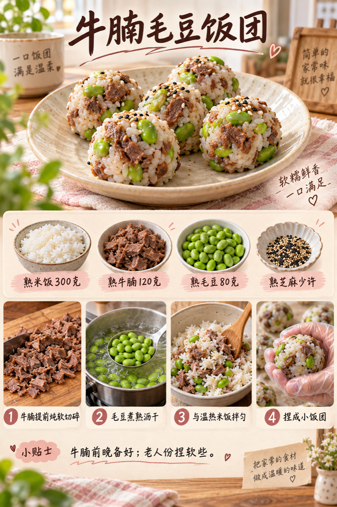
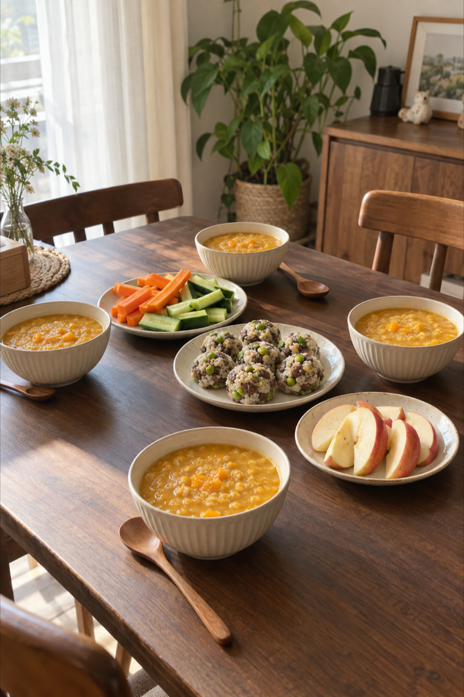

# 2026-09-14 早餐内容包

## 小红书标题

周一早餐抄这套！南瓜糊配饭团

## 小红书正文

周一给四口之家做南瓜燕麦小米糊、牛腩毛豆饭团，再备胡萝卜黄瓜条和苹果。牛腩、毛豆和米饭前晚煮熟冷藏；早上充分加热后拌成小饭团，同时热糊、焯胡萝卜，20分钟分餐。女儿份饭团捏小，老人份牛腩切细、米饭保持软糯。极忙就用热豆浆、熟蛋和前晚饭团。关注我，明早继续抄作业。

## 流量标签

#秋分与丰收节 #中秋国庆双节 #中秋家宴 #月饼测评 #秋日时髦尖子生 #尸皮针争议 #松针大油边 #秋天的第一杯奶茶 #户外骑行解压 #这次旅行local一下

## 互动问题

明天我做 4 个版本：A. 小学生长高版 B. 老人好消化版 C. 上班族快手版 D. 评论区留下你专属版。你家更需要哪个？评论 A/B/C/D，我按票数发；选 D 的直接留下年龄、家庭人数、忌口和早上可用时间。关注我，明早直接抄作业。

## 置顶评论

想要「7天不重样早餐表」的，评论“7天”。选 D 的留下年龄、家庭人数、忌口和早上可用时间，我会挑典型家庭做专属版，后面每天更新。

## 明天预告

明天预告：金枪鱼黄瓜杂粮饭团配南瓜牛奶羹。

## 菜单与备餐

- 南瓜燕麦小米糊：南瓜300克、燕麦片80克、小米80克、清水约1升；南瓜和小米前晚煮软冷藏，早上加燕麦充分加热并搅匀；按需加水调软。
- 牛腩毛豆饭团：熟米饭300克、已炖软牛腩120克、熟毛豆80克、熟芝麻少许；前晚炖软牛腩并煮熟毛豆；冷藏保存。早上米饭与牛腩充分加热后拌入毛豆，捏成小饭团。
- 胡萝卜黄瓜条：胡萝卜200克、黄瓜200克；胡萝卜切条焯软，黄瓜洗净切条；老人份胡萝卜再切小，黄瓜按吞咽情况处理。
- 苹果切片：苹果2个；洗净去核切薄片；孩子份切小口。

前晚准备：南瓜小米煮软、牛腩炖软、毛豆煮熟；米饭煮好后及时冷却并分别冷藏。胡萝卜、黄瓜、苹果洗净。

20 分钟时间线：0–5分钟充分加热南瓜小米糊和冷藏米饭、牛腩；5–12分钟加入燕麦煮熟，拌入熟毛豆捏小饭团；12–16分钟焯软胡萝卜、切黄瓜和苹果；16–20分钟分糊、摆盘并检查温度。

极忙 5 分钟方案：热无糖豆浆、前晚煮熟的鸡蛋、已充分加热的冷藏小饭团，5分钟。

## 发布状态

内容包已生成，待保存到 Tiny.C 草稿箱；未公开发布。仅保存草稿，不点击“发布”或发布评论。

## 话题来源

来源日期：2026-09-23。[话题台账](weekly-hot-tags.json)。本地精选，不等于已独立核实的官方热榜；补生成旧日期时按执行日时效检查并冻结来源。

## 配图

[图1文件](01-breakfast-overview-v2.png)

[图2文件](02-beef-edamame-riceball-process.png)

[图3文件](03-family-table.png)

## 内容包与发布描述

[content-package.json](content-package.json)。图片上传顺序与上文一致；标题、正文、10 个话题、互动问题、置顶评论及明天预告已同步。建议由用户在合适时间手动公开发布，此阶段仅暂存草稿。

## 图片核验

三张图片均为 853×1280 px，由独立源图经 `remove-ai-watermarks all` 生成；`identify --json` 未检测到可识别可见水印或 metadata 信号。不可见水印阶段因缺少 GPU 依赖跳过，不据此宣称绝对无水印。详见 [watermark-verification.json](watermark-verification.json)。
