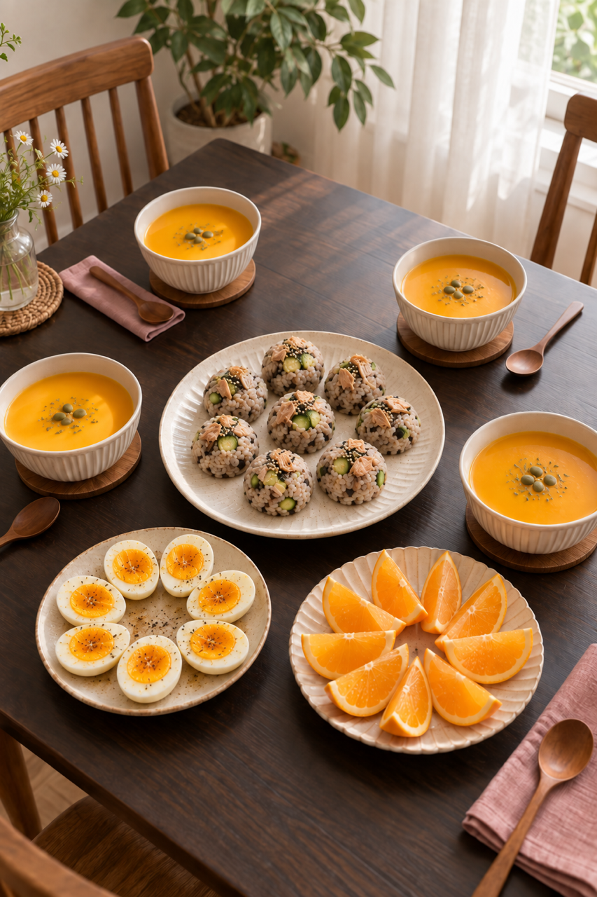
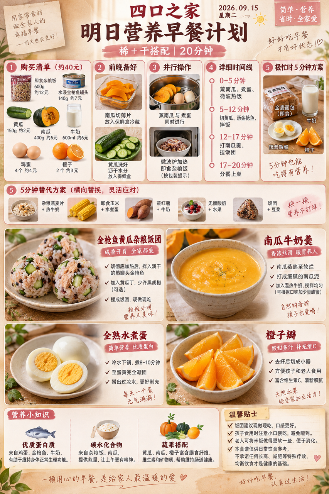
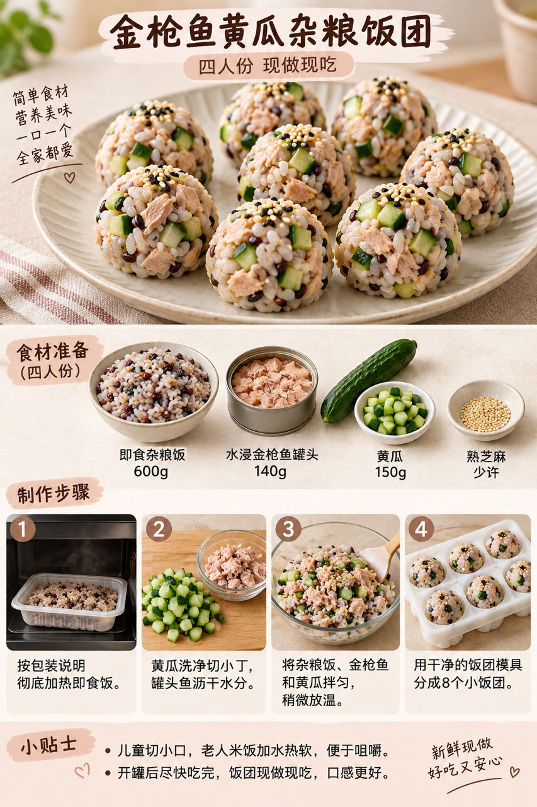

# 2026-09-15 早餐内容包

## 小红书标题

答应我，早餐试试这份杂粮饭团

## 小红书正文

第68天，金枪鱼黄瓜杂粮饭团配南瓜牛奶羹，再添全熟鸡蛋和橙子。前晚切好南瓜冷藏，早上蒸南瓜、煮蛋和热饭并行，约20分钟开饭。用即食杂粮饭和水浸金枪鱼罐头，省去现煮饭；饭团现做现吃，孩子切小口，老人米饭热软些。极忙时换即食面包、牛奶、预煮熟蛋和橙子，5分钟也能上桌。关注我，明早继续抄作业。

## 流量标签

#2026秋日重启计划 #中式辣感 #民间remake智慧 #我的不完美料理 #适我主义 #教师节 #中秋节 #秋分 #活人感与反精致 #抽象梗文化与情绪共鸣

## 互动问题

你家更需要哪个版本？A. 小学生长高版 B. 老人好消化版 C. 上班族快手版 D. 评论区留下你专属版。评论 A/B/C/D；选 D 的留下年龄、家庭人数、忌口和早上可用时间。

## 置顶评论

想要「7天不重样早餐表」的，评论“7天”。选 D 的留下年龄、家庭人数、忌口和早上可用时间，我会挑典型家庭做专属版，关注后续更新。

## 明天预告

明天预告：热豆浆配虾仁玉米饼，20分钟清淡早餐版。

## 发布状态

未发布；ready_for_review；should_publish=false。

## 话题来源

来源日期：2026-09-11。[话题台账](weekly-hot-tags.json)。本地精选，不是独立核实官方热榜。

## 配图

[图1文件](01-family-table.png)

[图2文件](02-breakfast-overview.png)

[图3文件](03-rice-ball-process.png)

## 内容包与发布描述

[content-package.json](content-package.json)。仅生成，不发布。按图1家庭餐桌、图2总览、图3制作过程顺序；发布需要另行授权。

