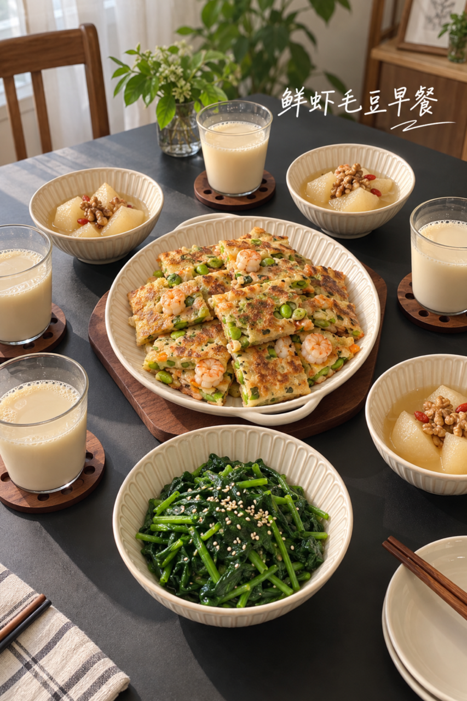
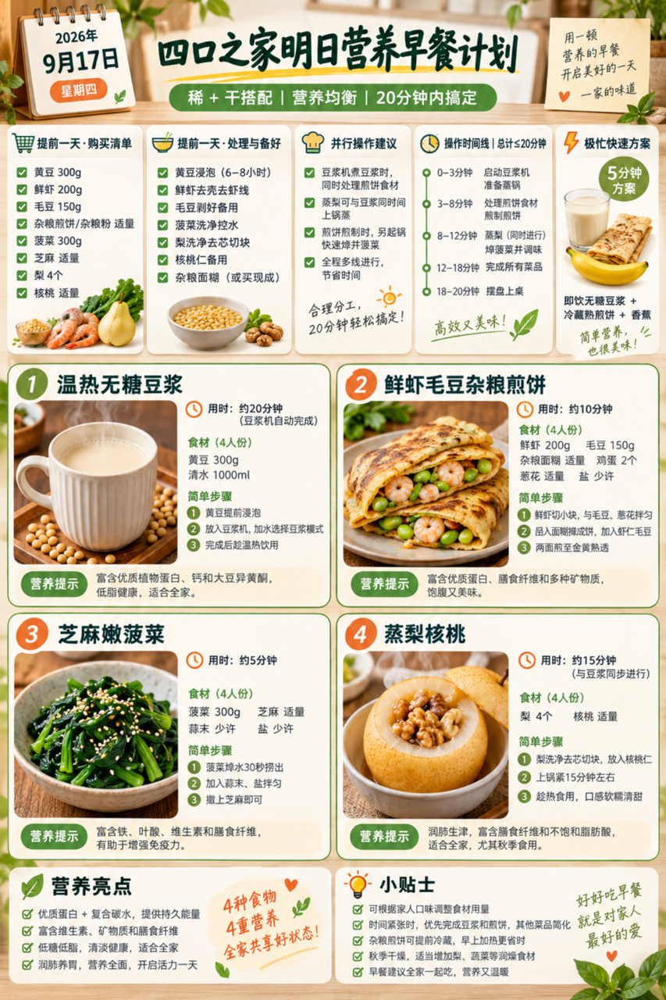
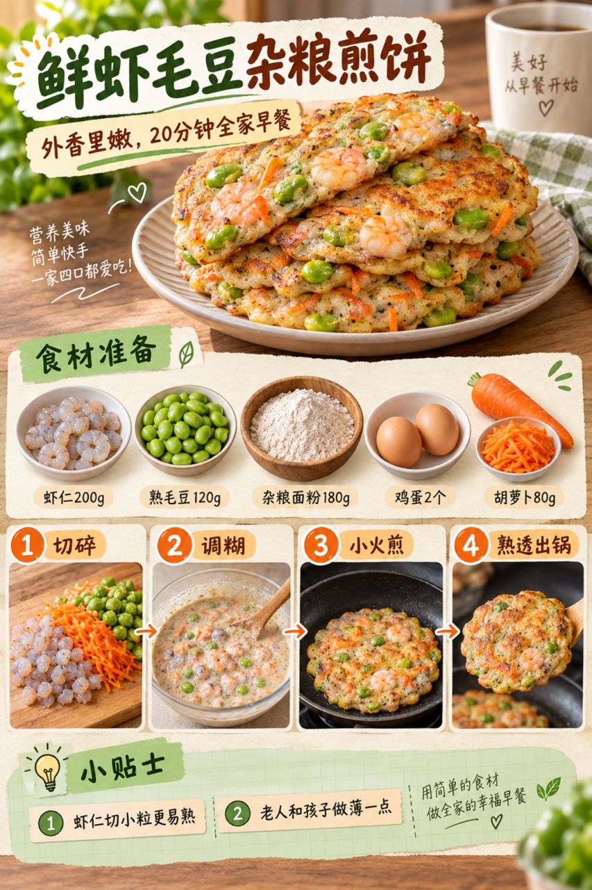

# 2026-09-17 早餐内容包

## 小红书标题

有手就会！鲜虾毛豆早餐饼

## 小红书正文

第70天，温热无糖豆浆配鲜虾毛豆杂粮煎饼，再添芝麻嫩菠菜和蒸梨核桃。前晚泡好黄豆、剥好毛豆；早上豆浆机启动后，同时煎饼、焯菜、蒸梨，20分钟上桌。虾仁、毛豆和鸡蛋补优质蛋白，豆浆补钙，杂粮更顶饱；孩子和老人吃薄饼少盐版。极忙时用即饮无糖豆浆、冷藏熟煎饼和香蕉，5分钟搞定。关注我，明早继续抄作业。

## 流量标签

#轻亚入门 #我的神级复刻 #我的不完美料理 #野生向导体验howto #万物非虚构 #镜头是爱意的具象化 #存肌肉就是存未来 #世界是我的兴趣班 #中秋节 #全国爱牙日

## 互动问题

明天我做 4 个版本：A. 小学生长高版 B. 老人好消化版 C. 上班族快手版 D. 评论区留下你专属版。你家更需要哪个？评论 A/B/C/D，我按票数发；选 D 的直接留下年龄、家庭人数、忌口和早上可用时间。关注我，明早直接抄作业。

## 置顶评论

想要「7天不重样早餐表」的，评论“7天”。选 D 的留下年龄、家庭人数、忌口和早上可用时间，我会挑典型家庭做专属版，后面每天更新。

## 明天预告

明天预告：不喝牛奶也高钙版，豆腐鱼片粥配玉米。

## 发布状态

未发布；ready_for_review；should_publish=false。当前及后续 Skill 默认只生成、不发布。

## 话题来源

来源日期：2026-09-15。[话题台账](weekly-hot-tags.json)。本地精选，不是独立核实官方热榜。

## 配图

[图1文件](01-family-table.png)

[图2文件](02-breakfast-overview.png)

[图3文件](03-shrimp-edamame-pancake-process.png)

## 内容包与发布描述

[content-package.json](content-package.json)。按图1家庭餐桌、图2总览、图3制作过程顺序；标题、正文、标签、互动问题、置顶评论与明天预告均已同步。建议上海时间早间发布，但本次及后续默认只生成，不执行浏览器发布。
