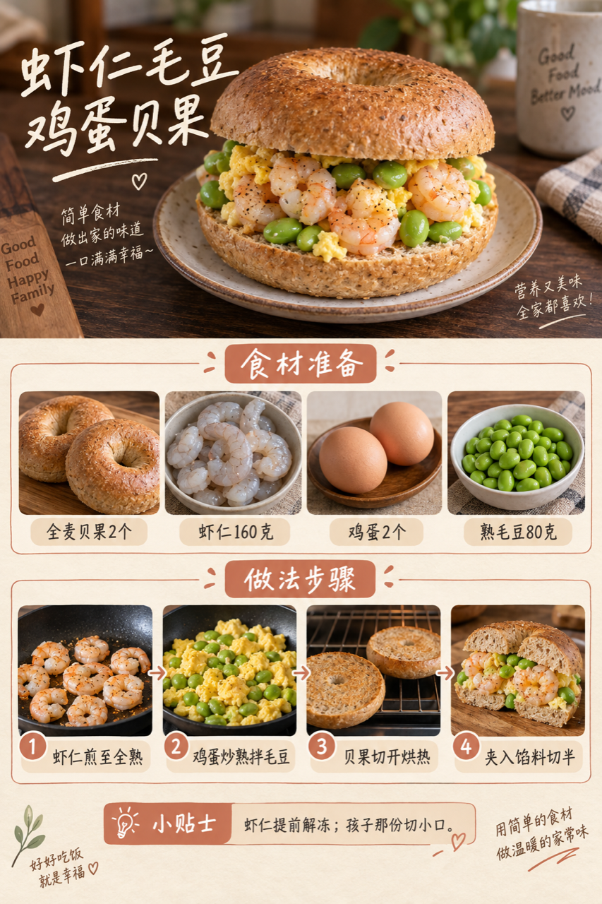
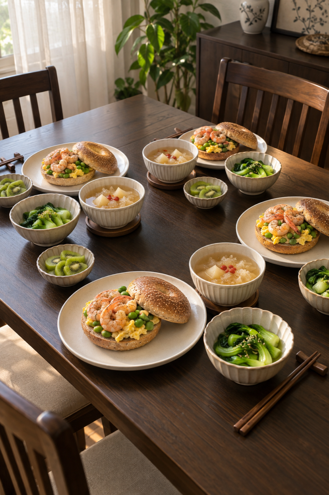

# 2026-09-20 早餐内容包

## 小红书标题

周日抄这套！虾仁贝果配银耳羹

## 小红书正文

周日给四口之家做热雪梨银耳羹、虾仁毛豆鸡蛋贝果，配清烫小油菜和猕猴桃。银耳羹前晚煮好冷藏，虾仁在冰箱解冻；早上热羹时把虾仁与鸡蛋煎熟、贝果烘热，20分钟上桌。女儿份贝果切小口，老人份银耳煮软、馅料切细。极忙时热羹配熟蛋和现成全麦面包。关注我，明早继续抄作业。

## 流量标签

#秋分与丰收节 #中秋国庆双节 #中秋家宴 #月饼测评 #秋日时髦尖子生 #尸皮针争议 #松针大油边 #秋天的第一杯奶茶 #户外骑行解压 #这次旅行local一下

## 互动问题

明天我做 4 个版本：A. 小学生长高版 B. 老人好消化版 C. 上班族快手版 D. 评论区留下你专属版。你家更需要哪个？评论 A/B/C/D，我按票数发；选 D 的直接留下年龄、家庭人数、忌口和早上可用时间。关注我，明早直接抄作业。

## 置顶评论

想要「7天不重样早餐表」的，评论“7天”。选 D 的留下年龄、家庭人数、忌口和早上可用时间，我会挑典型家庭做专属版，后面每天更新。

## 明天预告

明天预告：鱼肉豆腐手抓饼配温热玉米小米糊。

## 菜单与备餐

- 雪梨银耳羹：干银耳15克、雪梨2个、清水约1.2升、枸杞少许；银耳泡发洗净，与去核雪梨丁前晚煮软，及时冷藏；早上充分加热。
- 虾仁毛豆鸡蛋贝果：全麦贝果2个、虾仁160克、鸡蛋2个、熟毛豆80克；虾仁冷藏解冻后煎至全熟；鸡蛋炒熟拌入熟毛豆，贝果切半烘热后夹馅，四人分半份。
- 清烫小油菜：小油菜300克、熟芝麻少许；油菜洗净焯熟，少盐拌芝麻；老人份切细。
- 猕猴桃：猕猴桃2个；洗净去皮切片；孩子份切小块。

前晚准备：前晚煮软雪梨银耳羹并及时冷藏；虾仁置冷藏室安全解冻；毛豆煮熟冷藏；小油菜洗净沥水。

20 分钟时间线：0–5分钟充分加热银耳羹、切开烘热贝果，并烧开焯菜水；5–12分钟煎熟虾仁和鸡蛋、拌入熟毛豆；12–16分钟焯熟小油菜、准备猕猴桃；16–20分钟把馅料夹入贝果、分羹摆盘。

极忙 5 分钟方案：前晚银耳羹充分加热、提前煮熟的鸡蛋和现成全麦面包，5分钟。

## 发布状态

草稿已保存到专用 Codex-Breakfast-Chrome 中 Tiny.C 的本地图文草稿箱，保存时间 2026-09-23 06:37:37；未公开发布，也未发布评论。草稿仅存当前浏览器本地；后续请用同一登录 profile 手动检查并发布。记录与截图见 [draft.json](draft.json)、[保存前截图](draft-preflight.png)和[草稿箱核验截图](../2026-09-21/draft-verified.png)。

实际绑定 8 个原生话题：#中秋国庆双节、#中秋家宴、#月饼测评、#秋日时髦尖子生、#松针大油边、#秋天的第一杯奶茶、#户外骑行解压、#这次旅行local一下。#秋分与丰收节、#尸皮针争议未找到同名现有候选，未新建，也未保留未绑定文本。

## 话题来源

来源日期：2026-09-23。[话题台账](weekly-hot-tags.json)。本地精选，不等于已独立核实的官方热榜；补生成旧日期时按执行日时效检查并冻结来源。

## 配图

[图1文件](01-shrimp-edamame-bagel-process.png)

[图2文件](02-family-table.png)

[图3文件](03-breakfast-overview-v2.png)

## 内容包与发布描述

[content-package.json](content-package.json)。三张图片按顺序上传；标题、正文、互动问题和明天预告已写入草稿。内容包中的 10 个候选话题实际绑定 8 个、略过 2 个；置顶评论仅保留在内容包中，待用户手动发布后自行添加。

## 图片核验

三张图片均为 853×1280 px，由独立源图经 `remove-ai-watermarks all` 生成；`identify --json` 未检测到可识别可见水印或 metadata 信号。不可见水印阶段因缺少 GPU 依赖跳过，不据此宣称绝对无水印。详见 [watermark-verification.json](watermark-verification.json)。
