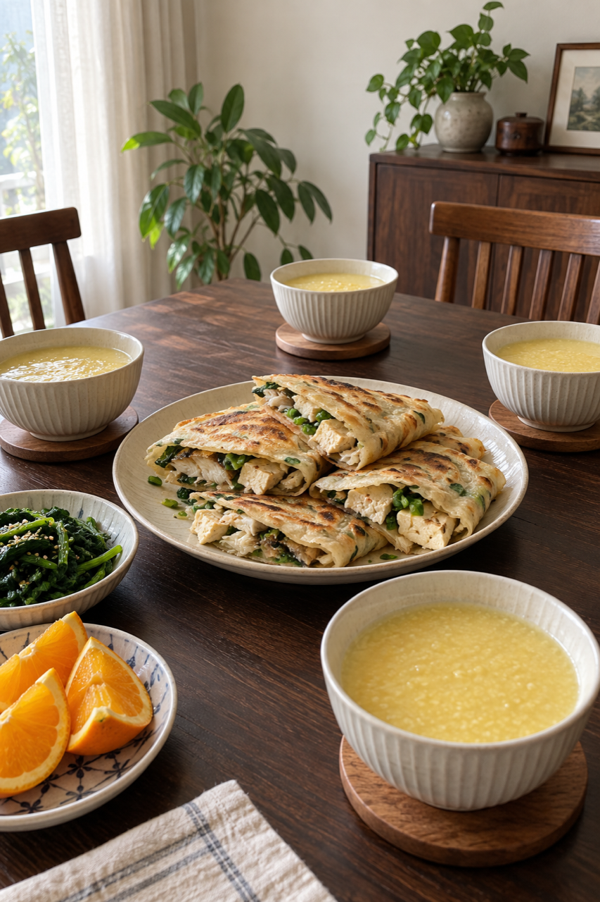
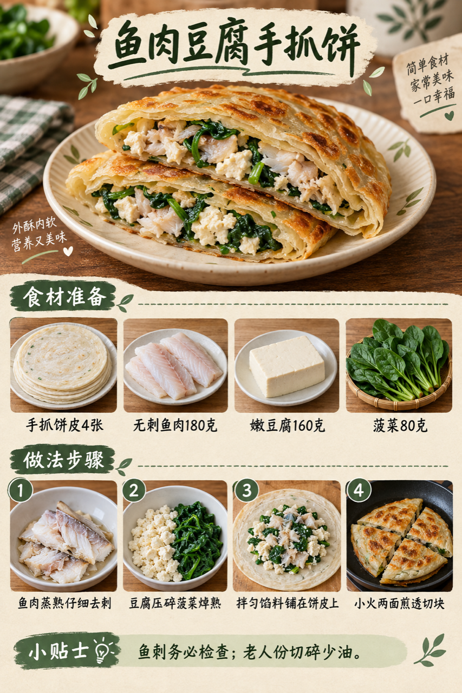
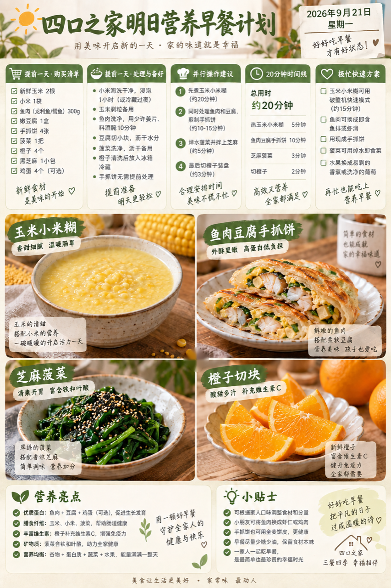

# 2026-09-21 早餐内容包

## 小红书标题

周一早餐抄这套！鱼肉豆腐手抓饼

## 小红书正文

周一用玉米小米糊配鱼肉豆腐手抓饼，再添芝麻菠菜和橙子。前晚把鱼蒸熟仔细去刺、玉米小米糊煮好冷藏；早上充分加热糊，拌鱼肉豆腐馅并小火煎透饼，同时焯菠菜，20分钟分餐。女儿份逐口检查鱼刺，老人份切碎、少油煎软。极忙就用即食杂粮糊、熟蛋和馒头。关注我，明早继续抄作业。

## 流量标签

#秋分与丰收节 #中秋国庆双节 #中秋家宴 #月饼测评 #秋日时髦尖子生 #尸皮针争议 #松针大油边 #秋天的第一杯奶茶 #户外骑行解压 #这次旅行local一下

## 互动问题

明天我做 4 个版本：A. 小学生长高版 B. 老人好消化版 C. 上班族快手版 D. 评论区留下你专属版。你家更需要哪个？评论 A/B/C/D，我按票数发；选 D 的直接留下年龄、家庭人数、忌口和早上可用时间。关注我，明早直接抄作业。

## 置顶评论

想要「7天不重样早餐表」的，评论“7天”。选 D 的留下年龄、家庭人数、忌口和早上可用时间，我会挑典型家庭做专属版，后面每天更新。

## 明天预告

明天预告：胡萝卜牛肉小米粥配葱香豆腐鸡蛋卷。

## 菜单与备餐

- 玉米小米糊：鲜玉米粒200克、小米100克、清水约1升；玉米与小米前晚煮熟后及时冷藏；早上充分加热，可调成老人易入口的稠度。
- 鱼肉豆腐手抓饼：手抓饼皮4张、无刺鱼肉300克、嫩豆腐160克、菠菜80克；鱼肉提前蒸熟并仔细检查鱼刺，冷藏保存；豆腐压碎、菠菜焯熟切细，拌馅铺饼皮后小火两面煎透切块。
- 芝麻菠菜：菠菜250克、熟芝麻10克；菠菜洗净焯熟沥水，少盐拌芝麻；老人份切细。
- 橙子切块：橙子4个；洗净去皮分瓣，给孩子去籽并切小块。

前晚准备：前晚蒸熟鱼肉并仔细去刺、及时冷藏；玉米小米糊煮熟冷藏；菠菜洗净；豆腐冷藏；橙子洗净。

20 分钟时间线：0–5分钟充分加热玉米小米糊并备好馅料；5–15分钟拌鱼肉豆腐菠菜馅、手抓饼小火两面煎透；15–18分钟焯熟并拌好芝麻菠菜；18–20分钟切橙子、切饼并分餐。

极忙 5 分钟方案：即食无糖杂粮糊、前晚煮熟鸡蛋和现成馒头，5分钟。

## 发布状态

内容包已生成，待保存到 Tiny.C 草稿箱；未公开发布。仅保存草稿，不点击“发布”或发布评论。

## 话题来源

来源日期：2026-09-23。[话题台账](weekly-hot-tags.json)。本地精选，不等于已独立核实的官方热榜；补生成旧日期时按执行日时效检查并冻结来源。

## 配图

[图1文件](01-family-table.png)

[图2文件](02-fish-tofu-wrap-process.png)

[图3文件](03-breakfast-overview.png)

## 内容包与发布描述

[content-package.json](content-package.json)。图片上传顺序与上文一致；标题、正文、10 个话题、互动问题、置顶评论及明天预告已同步。建议由用户在合适时间手动公开发布，此阶段仅暂存草稿。

## 图片核验

三张图片均为 853×1280 px，由独立源图经 `remove-ai-watermarks all` 生成；`identify --json` 未检测到可识别可见水印或 metadata 信号。不可见水印阶段因缺少 GPU 依赖跳过，不据此宣称绝对无水印。详见 [watermark-verification.json](watermark-verification.json)。
