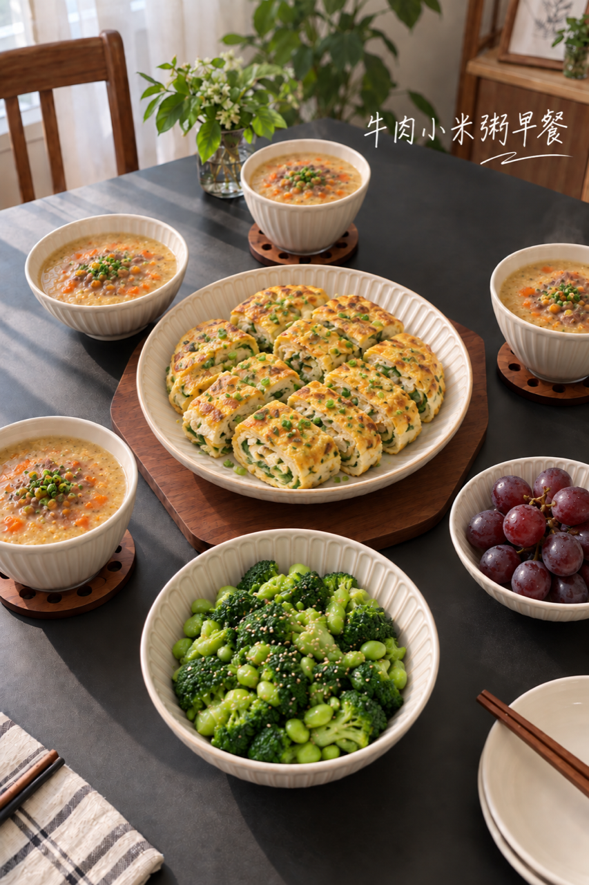
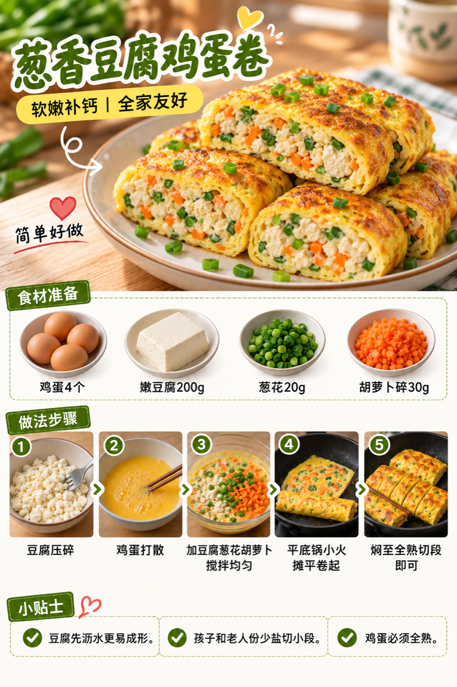
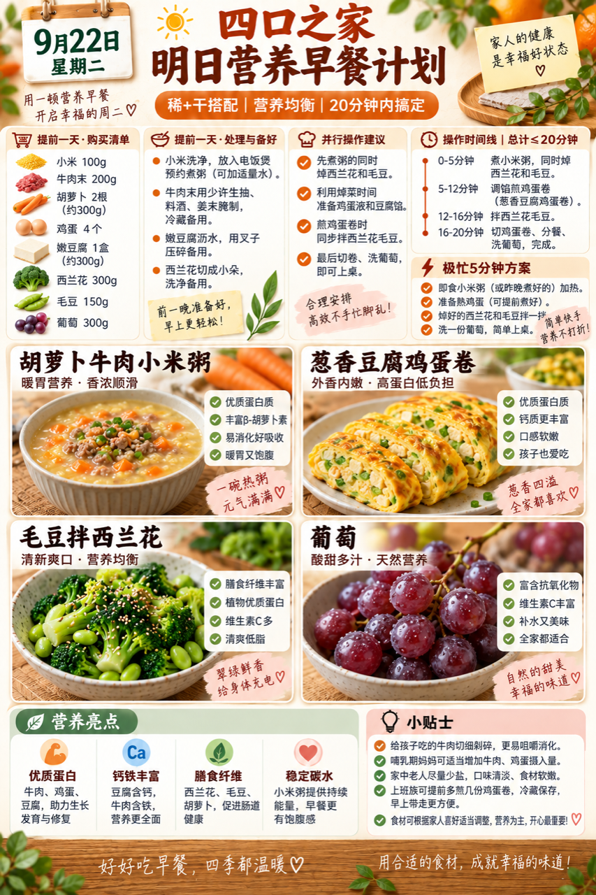

# 2026-09-22 早餐内容包

## 小红书标题

直接抄！牛肉小米粥早餐

## 小红书正文

第73天，胡萝卜牛肉小米粥配葱香豆腐鸡蛋卷，再添毛豆拌西兰花和葡萄。前晚预约小米粥、牛肉末调味、豆腐压碎；早上热粥时焯菜，平底锅小火卷蛋，20分钟上桌。牛肉、鸡蛋和豆腐补蛋白与铁钙，小米温热顶饱；老人少盐软嫩，孩子牛肉切细。极忙时即食小米粥、熟鸡蛋、焯菜和葡萄，5分钟搞定。关注我，明早继续抄作业。

## 流量标签

#轻亚入门 #我的神级复刻 #我的不完美料理 #野生向导体验howto #万物非虚构 #镜头是爱意的具象化 #存肌肉就是存未来 #世界是我的兴趣班 #中秋节 #全国爱牙日

## 互动问题

明天我做 4 个版本：A. 小学生长高版 B. 老人好消化版 C. 上班族快手版 D. 评论区留下你专属版。你家更需要哪个？评论 A/B/C/D，我按票数发；选 D 的直接留下年龄、家庭人数、忌口和早上可用时间。关注我，明早直接抄作业。

## 置顶评论

想要「7天不重样早餐表」的，评论“7天”。选 D 的留下年龄、家庭人数、忌口和早上可用时间，我会挑典型家庭做专属版，后面每天更新。

## 明天预告

明天预告：老人软和好消化版，鲜虾青菜馄饨配山药芝麻糕。

## 发布状态

未发布；ready_for_review；should_publish=false。当前及后续 Skill 默认只生成、不发布。

## 话题来源

来源日期：2026-09-15。[话题台账](weekly-hot-tags.json)。本地精选，不是独立核实官方热榜；其中节日节点可能已过期，仍按 Skill 规则原样保留最新本地 Top10。

## 配图

[图1文件](01-family-table.png)

[图2文件](02-tofu-egg-roll-process.png)

[图3文件](03-breakfast-overview.png)

## 内容包与发布描述

[content-package.json](content-package.json)。按图1家庭餐桌、图2制作过程、图3总览顺序；标题、正文、标签、互动问题、置顶评论与明天预告均已同步。建议上海时间早间发布，但本次及后续默认只生成，不执行浏览器发布。

## 图片核验

3 张最终图片均为 853×1280 px，由独立源图经 `remove-ai-watermarks all` 生成新文件；`identify --json` 未检测到可识别水印或 metadata 信号。不可见水印阶段因缺少 GPU 依赖跳过，按 Skill 规则不拦截，也不据此宣称图片绝对无水印。详见 [watermark-verification.json](watermark-verification.json)。
