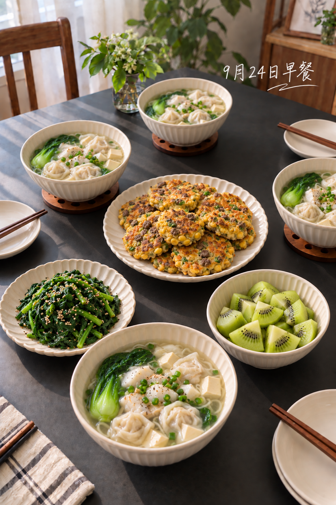
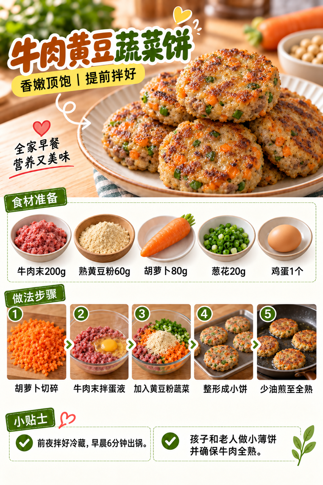
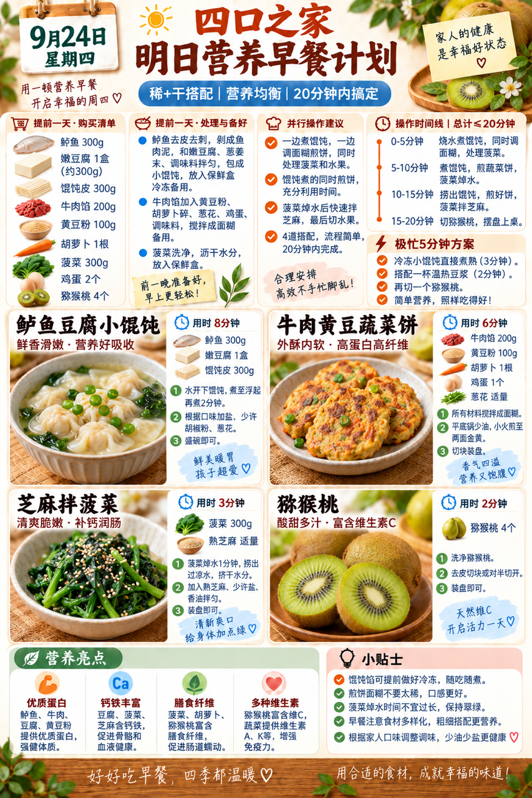

# 2026-09-24 早餐内容包

## 小红书标题

答应我，早餐试试鱼肉馄饨

## 小红书正文

第75天，鲈鱼豆腐小馄饨配牛肉黄豆蔬菜饼，再添芝麻菠菜和猕猴桃。前晚包好馄饨冷冻、饼糊拌好冷藏；早上煮馄饨时同步煎饼，20分钟分餐。鱼肉、牛肉和黄豆补优质蛋白，菠菜和猕猴桃添纤维；孩子和老人份做小、少盐。极忙时冷冻馄饨、温豆浆和猕猴桃，5分钟上桌。关注我，明早继续抄作业。

## 流量标签

#秋分与丰收节 #中秋国庆双节 #中秋家宴 #月饼测评 #秋日时髦尖子生 #尸皮针争议 #松针大油边 #秋天的第一杯奶茶 #户外骑行解压 #这次旅行local一下

## 互动问题

明天我做 4 个版本：A. 小学生长高版 B. 老人好消化版 C. 上班族快手版 D. 评论区留下你专属版。你家更需要哪个？评论 A/B/C/D，我按票数发；选 D 的直接留下年龄、家庭人数、忌口和早上可用时间。关注我，明早直接抄作业。

## 置顶评论

想要「7天不重样早餐表」的，评论“7天”。选 D 的留下年龄、家庭人数、忌口和早上可用时间，我会挑典型家庭做专属版，后面每天更新。

## 明天预告

明天预告：老人软和好消化版，南瓜小米糊配鳕鱼豆腐饼。

## 发布状态

未发布；ready_for_review；should_publish=false。内容包已生成，待保存到 Tiny.C 草稿箱。

## 话题来源

来源日期：2026-09-23。[话题台账](weekly-hot-tags.json)。本地精选，不是独立核实官方热榜。

## 配图

[图1文件](01-family-table.png)

[图2文件](02-beef-soy-patty-process.png)

[图3文件](03-breakfast-overview.png)

## 内容包与发布描述

[content-package.json](content-package.json)。随机顺序为图1家庭餐桌、图2制作过程、图3早餐总览；标题、正文、标签、互动问题、置顶评论与明天预告均已同步。建议上海时间早间从 Tiny.C 草稿手动发布；本次自动化只保存草稿，不执行发布。

## 图片核验

3 张最终图片均为 853×1280 px，由独立源图经 `remove-ai-watermarks all` 生成新文件；`identify --json` 未检测到可识别水印或 metadata 信号。不可见水印阶段因缺少 GPU 依赖跳过，按 Skill 规则不拦截，也不据此宣称图片绝对无水印。详见 [watermark-verification.json](watermark-verification.json)。
