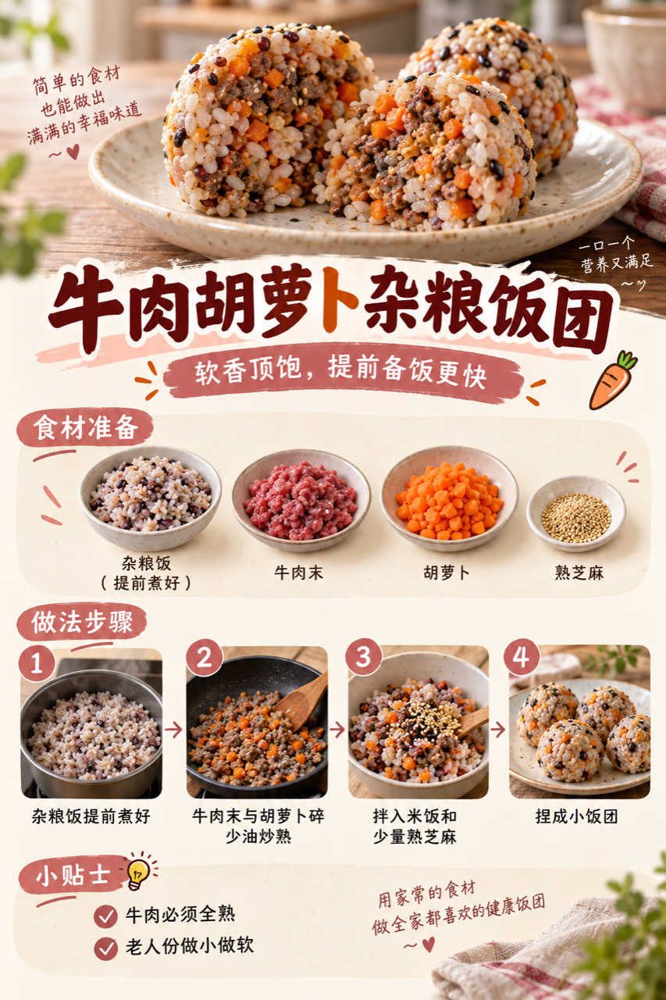
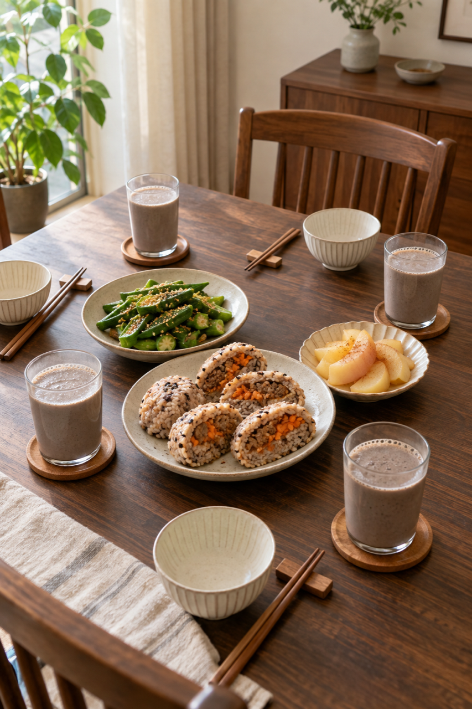

# 2026-09-25 早餐内容包

## 小红书标题

直接抄作业！牛肉饭团早餐

## 小红书正文

第76天，黑豆核桃豆浆配牛肉胡萝卜杂粮饭团，再添芝麻秋葵和蒸苹果。前晚泡豆、煮好杂粮饭，牛肉末和胡萝卜切好冷藏；早上豆浆机启动后同步炒馅、捏饭团，20分钟分餐。牛肉、黑豆补优质蛋白和铁，秋葵与苹果添纤维；老人份饭团做小做软。极忙时用即饮无糖豆浆、冷藏饭团和香蕉，5分钟上桌。关注我，明早继续抄作业。

## 流量标签

#秋分与丰收节 #中秋国庆双节 #中秋家宴 #月饼测评 #秋日时髦尖子生 #尸皮针争议 #松针大油边 #秋天的第一杯奶茶 #户外骑行解压 #这次旅行local一下

## 互动问题

明天我做 4 个版本：A. 小学生长高版 B. 老人好消化版 C. 上班族快手版 D. 评论区留下你专属版。你家更需要哪个？评论 A/B/C/D，我按票数发；选 D 的直接留下年龄、家庭人数、忌口和早上可用时间。关注我，明早直接抄作业。

## 置顶评论

想要「7天不重样早餐表」的，评论“7天”。选 D 的留下年龄、家庭人数、忌口和早上可用时间，我会挑典型家庭做专属版，后面每天更新。

## 明天预告

明天预告：不喝牛奶也高钙版，芝麻山药糊配虾仁豆腐蒸饺。

## 发布状态

内容包已生成并校验，待保存到 Tiny.C 草稿箱；未发布；ready_for_review；should_publish=false。

## 话题来源

来源日期：2026-09-23。[话题台账](weekly-hot-tags.json)。本地精选，不是独立核实官方热榜。

## 配图

[图1文件](01-beef-carrot-riceball-process.png)

[图2文件](02-breakfast-overview.png)

[图3文件](03-family-table.png)

## 内容包与发布描述

[content-package.json](content-package.json)。随机顺序为图1制作过程、图2早餐总览、图3家庭餐桌；标题、正文、10 个标签、互动问题、置顶评论与明天预告均已同步。建议上海时间早间从 Tiny.C 草稿手动发布；本次自动化只保存草稿，不执行发布。

## 图片核验

3 张最终图片均为 853×1280 px，由独立源图经 `remove-ai-watermarks all` 生成新文件；`identify --json` 未检测到可识别水印或 metadata 信号。不可见水印阶段因缺少 GPU 依赖跳过，按 Skill 规则不拦截，也不据此宣称图片绝对无水印。详见 [watermark-verification.json](watermark-verification.json)。
