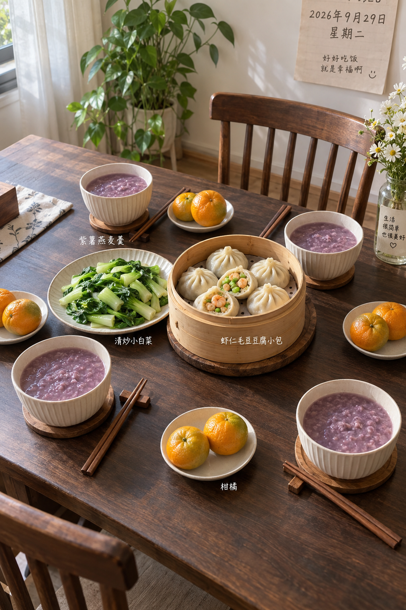
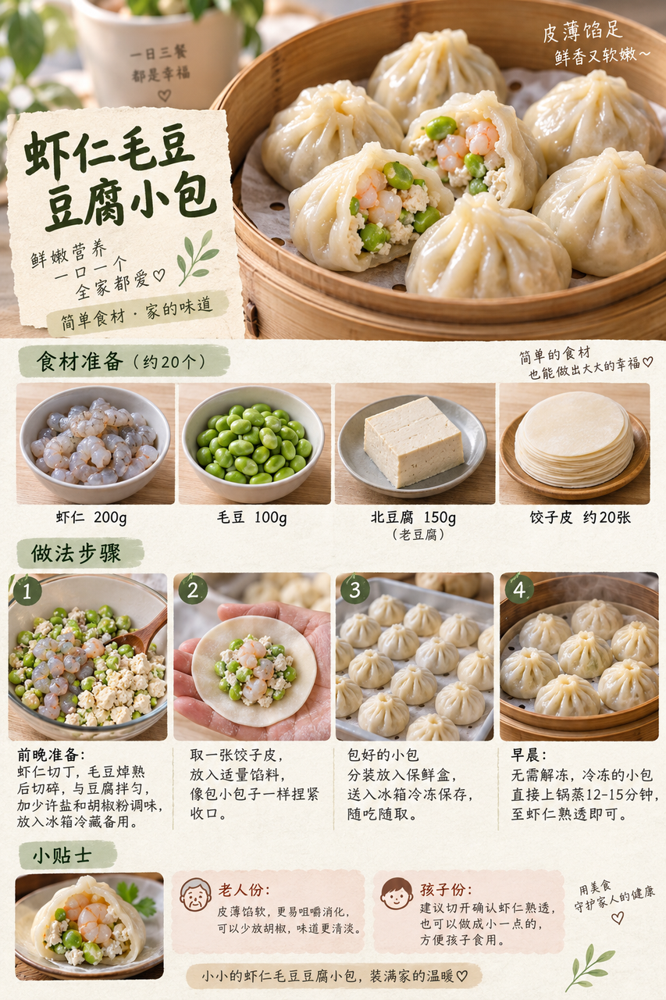

# 2026-09-29 早餐内容包

## 小红书标题

直接抄作业！虾仁小包早餐

## 小红书正文

今晚包好虾仁毛豆豆腐小包冷冻，紫薯蒸熟冷藏。明早小包直接上锅蒸透，同时把紫薯燕麦羹热好、快炒小白菜，配上柑橘，四口之家20分钟吃上热乎早餐。虾仁和豆腐补蛋白，毛豆添纤维；老人份做小做软，孩子份切开确认熟透。赶时间换即饮无糖豆浆、全麦面包、即食熟鸡蛋和香蕉，5分钟上桌。关注我，明早继续抄作业。

## 流量标签

#秋分与丰收节 #中秋国庆双节 #中秋家宴 #月饼测评 #秋日时髦尖子生 #尸皮针争议 #松针大油边 #秋天的第一杯奶茶 #户外骑行解压 #这次旅行local一下

## 互动问题

明天我做 4 个版本：A. 小学生长高版 B. 老人好消化版 C. 上班族快手版 D. 评论区留下你专属版。你家更需要哪个？评论 A/B/C/D，我按票数发；选 D 的直接留下年龄、家庭人数、忌口和早上可用时间。关注我，明早直接抄作业。

## 置顶评论

想要「7天不重样早餐表」的，评论“7天”。选 D 的留下年龄、家庭人数、忌口和早上可用时间，我会挑典型家庭做专属版，后面每天更新。

## 明天预告

明天预告：不喝牛奶也高钙版，芝麻豆腐玉米卷配热梨羹。

## 发布状态

草稿保存已按用户后续要求暂停，未发布；ready_for_review；should_publish=false。

## 菜单与20分钟流程

- 紫薯燕麦羹 + 虾仁毛豆豆腐小包 + 清炒小白菜 + 柑橘。
- 前晚准备：前晚虾仁切丁、毛豆焯熟，拌碎豆腐后包成小包并冷冻；紫薯蒸熟冷藏；小白菜洗净沥干。
- 早晨流程：0–5分钟冷冻小包入蒸锅，紫薯与燕麦加水入小锅加热；5–10分钟搅拌紫薯燕麦羹，同时切好小白菜；10–15分钟快炒小白菜，检查蒸锅水量；15–20分钟确认虾仁小包彻底蒸熟，分装羹、小包、青菜和柑橘。
- 极忙5分钟：即饮无糖豆浆、全麦面包、即食熟鸡蛋和香蕉，5分钟。
- 预算：约40元/四人。

## 话题来源

来源日期：2026-09-23。[话题台账](weekly-hot-tags.json)。本地精选，不是独立核实官方热榜。

## 配图

[图1文件](01-family-table.png)

[图2文件](02-breakfast-overview.png)

[图3文件](03-shrimp-edamame-bun-process.png)

## 内容包与发布描述

[content-package.json](content-package.json)。图片按上述随机顺序排列；标题、正文、标签、互动问题、置顶评论和明天预告已同步。建议上海时间早间手动审阅；草稿保存当前暂停，未执行发布。

## 图片核验

3 张最终图片均为 853×1280 px，由独立源图经 `remove-ai-watermarks all` 生成新文件；`identify --json` 未检测到可识别水印或 metadata 信号。不可见水印阶段因缺少 GPU 依赖跳过，按 Skill 规则不拦截，也不据此宣称图片绝对无水印。详见 [watermark-verification.json](watermark-verification.json)。
