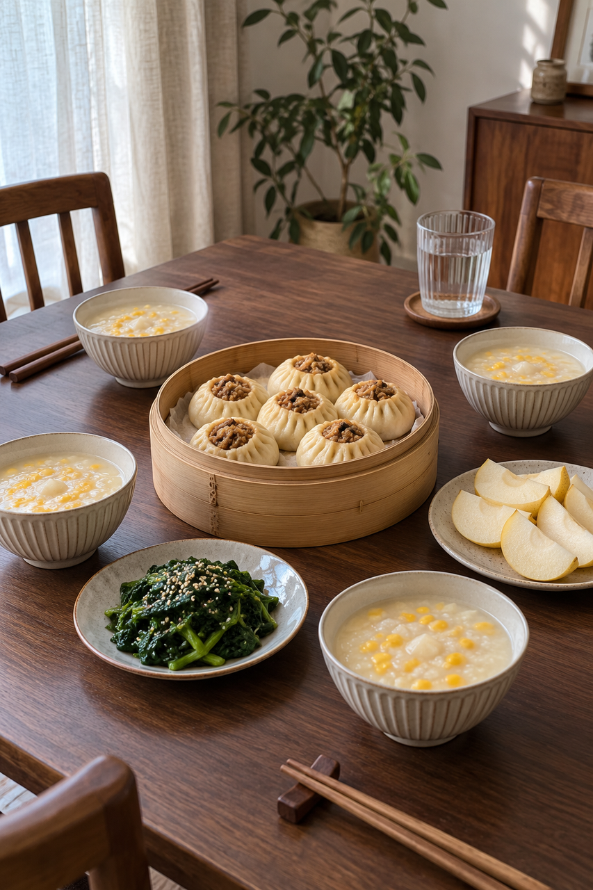
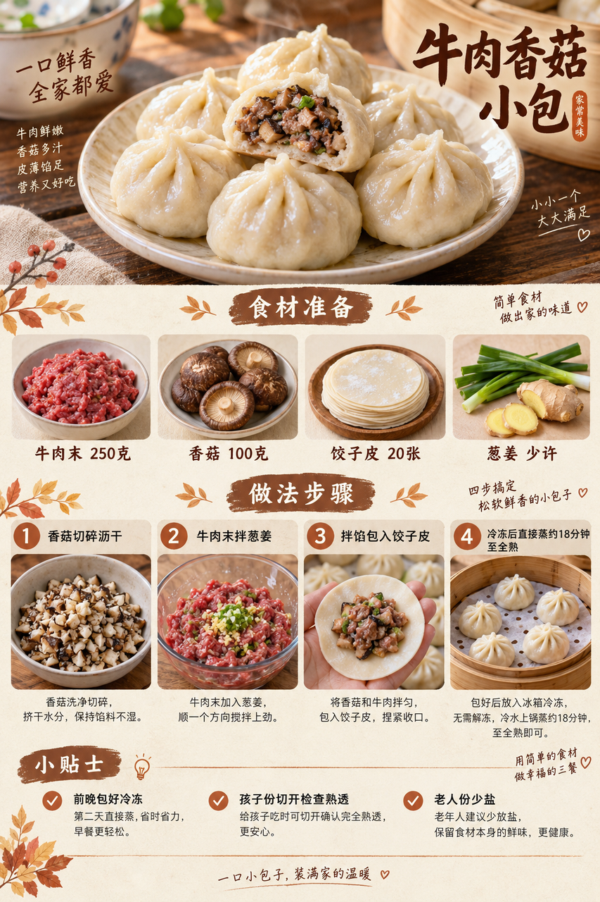
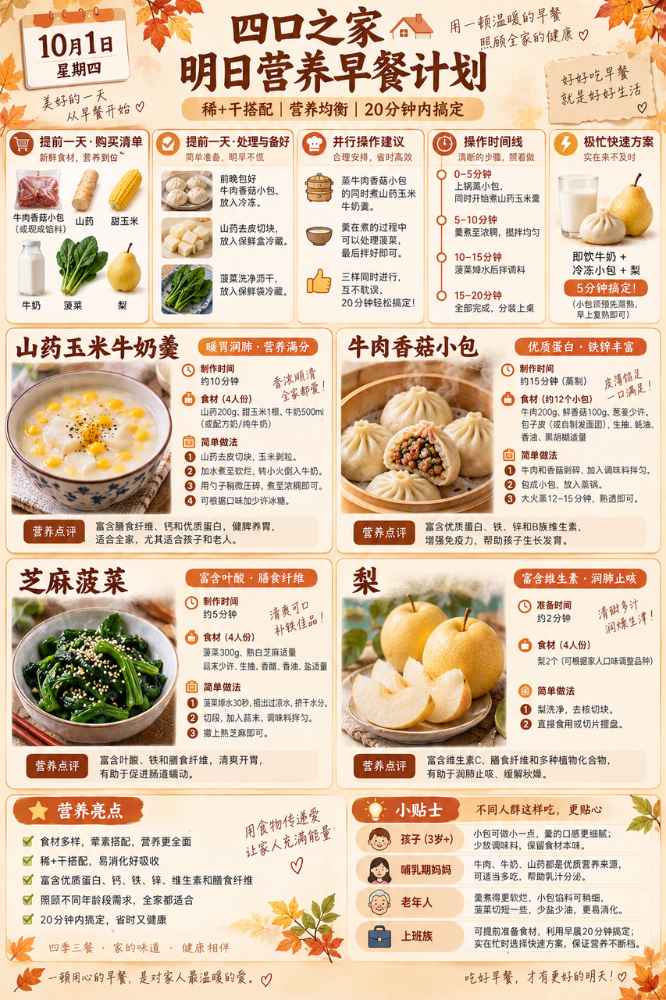

# 2026-10-01 早餐内容包

## 小红书标题

有手就会！牛肉香菇小包早餐

## 小红书正文

今晚把牛肉香菇小包包好冷冻，山药切块、菠菜洗净。明早小包直接蒸约18分钟，同时煮山药玉米牛奶羹，最后拌芝麻菠菜、切梨，四口之家20分钟吃上热乎早餐。牛肉、牛奶补蛋白，老人份少盐切小，孩子份切开确认小包熟透。极忙时用预蒸熟的小包复热，配即饮牛奶和梨，5分钟上桌。关注我，明早继续抄作业。

## 流量标签

#oots #我的微缩世界 #一公里摄影大赛 #九月就听九月底 #我在山西穿越了 #我的市集宝藏单品 #葡萄酒品酒笔记 #早餐吃什么 #高个子穿搭 #商业思维

## 互动问题

明天我做 4 个版本：A. 小学生长高版 B. 老人好消化版 C. 上班族快手版 D. 评论区留下你专属版。你家更需要哪个？评论 A/B/C/D，我按票数发；选 D 的直接留下年龄、家庭人数、忌口和早上可用时间。关注我，明早直接抄作业。

## 置顶评论

想要「7天不重样早餐表」的，评论“7天”。选 D 的留下年龄、家庭人数、忌口和早上可用时间，我会挑典型家庭做专属版，后面每天更新。

## 明天预告

明天预告：不喝牛奶也高钙版，芝麻豆腐玉米卷配温热梨羹。

## 发布状态

Tiny.C 草稿已保存并经草稿箱回读，未发布；ready_for_review；should_publish=false。[草稿记录](draft.json)。

## 菜单与20分钟流程

- 山药玉米牛奶羹 + 牛肉香菇小包 + 芝麻菠菜 + 梨。
- 前晚准备：前晚将牛肉末与香菇碎拌馅，包约20个小包后冷冻；山药去皮切块冷藏；菠菜洗净沥干。
- 早晨流程：0–5分钟冷冻小包上蒸锅，山药与甜玉米加水入锅；5–10分钟把羹煮软后加入牛奶，小包继续蒸；10–15分钟菠菜焯熟沥干，拌少量熟芝麻；15–20分钟确认小包彻底熟透，梨去核切片，分装上桌。
- 极忙5分钟：前晚已蒸熟冷藏的小包微波彻底复热，配即饮牛奶和梨，5分钟。
- 预算：约40元/四人。

## 话题来源

来源日期：2026-09-28。[话题台账](weekly-hot-tags.json)。本地精选，不是独立核实官方热榜。

## 配图

[图1文件](01-family-table.png)

[图2文件](02-beef-mushroom-bun-process.png)

[图3文件](03-breakfast-overview.png)

## 内容包与发布描述

[content-package.json](content-package.json)。图片按上述随机顺序排列；标题、正文、标签、互动问题、置顶评论和明天预告已同步。建议上海时间早间手动审阅；Tiny.C 草稿已暂存，未发布。后续手动操作请使用 Tiny.C 登录态。

## 图片核验

3 张最终图片均由 remove-ai-watermarks all 从独立 853×1280 源文件生成；identify --json 未检测到可识别水印或 metadata 信号。不可见水印阶段因缺少 GPU 依赖跳过，按 Skill 规则不拦截。详见 watermark-verification.json。 不据此宣称图片绝对无水印。

## 草稿箱核验

草稿 ID：`9e75b84f-4825-4975-b721-814c0e702176`；草稿箱显示保存于 2026-10-01 00:44:41（America/New_York）。重开后标题、3 张图片及 10 个按台账顺序绑定的原生话题一致。未点击发布或发表评论。[草稿记录](draft.json)；[保存前截图](draft-preflight.png)；[重开核验截图](draft-after-save.png)。
